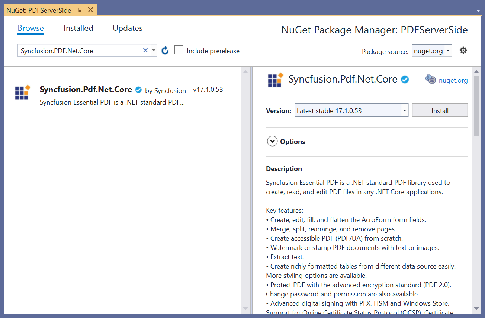
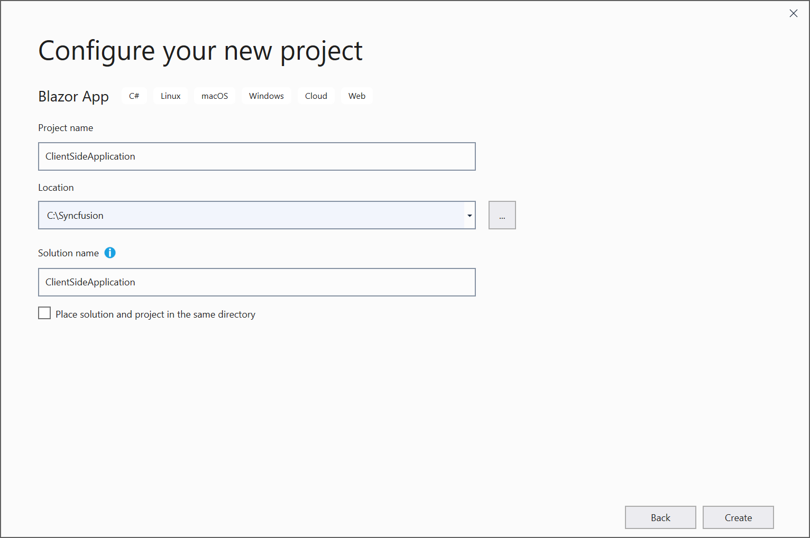
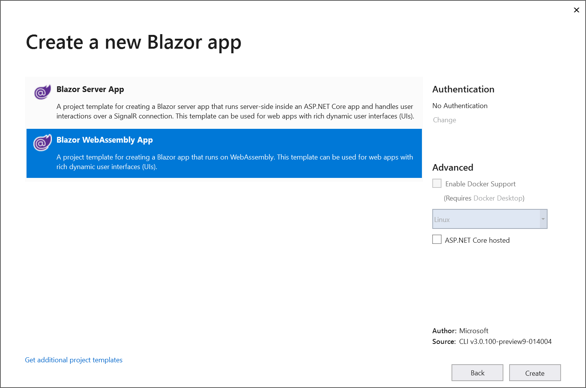
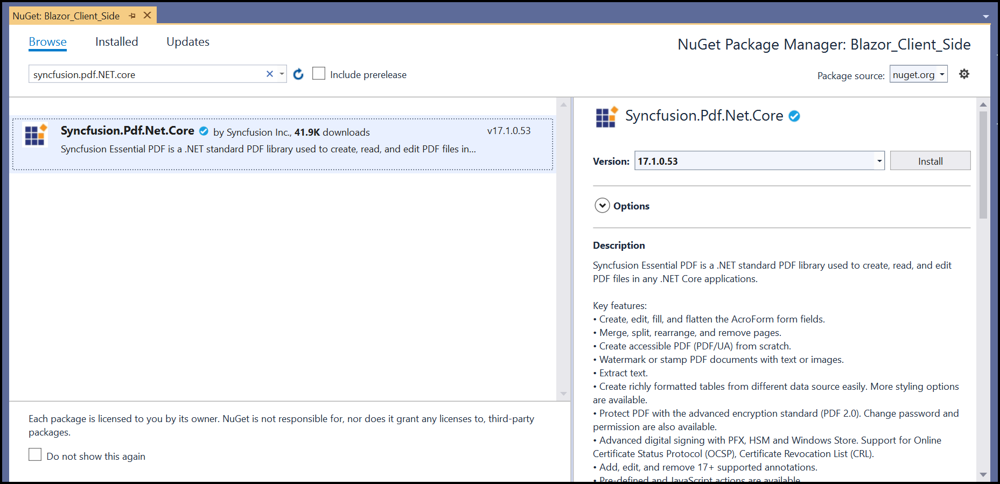

# Create or Generate PDF file in Blazor

Syncfusion Essential PDF is a [Blazor PDF library](https://www.syncfusion.com/pdf-framework/blazor/pdf-library) used to create, read, and edit PDF documents in Blazor. This library also offers functionality to merge, split, stamp, forms, and secure PDF files.

In your Blazor application, add the following assemblies to use Essential PDF:

* Syncfusion.Compression.Portable.dll
* Syncfusion.Pdf.Portable.dll 

For more details, refer to this [Assemblies Required](/File-Formats/PDF/Assemblies-Required) documentation.

## Steps to create PDF document in Blazor Server-Side application

Step 1: Create a new C# Blazor server-side application project. Select Blazor App from the template and click the Next button.

Step 2: Now, the project configuration window appears. Click Create button to create a new project with the default project configuration.

Step 3: Choose Blazor Server App from the dashboard and click Create button to create a new Blazor server-side application.

Step 4: Install the [Syncfusion.PDF.Net.Core](https://www.nuget.org/packages/Syncfusion.pdf.Net.Core) NuGet package as a reference to your Blazor application from [NuGet.org](https://www.nuget.org).

Step 5: Create a new cs file named  ``ExportService`` under ``Data`` folder and include the following namespaces in the file.



using Syncfusion.Pdf;
using Syncfusion.Pdf.Graphics;
using Syncfusion.Pdf.Grid;
using Syncfusion.Drawing;



Add the following method in the ``ExportService`` class



//Export weather data to PDF document.
public MemoryStream CreatePdf(WeatherForecast[] forecasts)
{
    if (forecasts == null)
    {
        throw new ArgumentNullException("Forecast cannot be null");
    }
   //Create a new PDF document
    using (PdfDocument pdfDocument = new PdfDocument())
    {

        int paragraphAfterSpacing = 8;
        int cellMargin = 8;

        //Add page to the PDF document
        PdfPage page = pdfDocument.Pages.Add();

        //Create a new font
        PdfStandardFont font = new PdfStandardFont(PdfFontFamily.TimesRoman, 16);

        //Create a text element to draw a text in PDF page
        PdfTextElement title = new PdfTextElement("Weather Forecast", font, PdfBrushes.Black);
        PdfLayoutResult result = title.Draw(page, new PointF(0, 0));

        PdfStandardFont contentFont = new PdfStandardFont(PdfFontFamily.TimesRoman, 12);
        PdfTextElement content = new PdfTextElement("This component demonstrates fetching data from a service and Exporting the data to PDF document using Syncfusion .NET PDF library.", contentFont, PdfBrushes.Black);
        PdfLayoutFormat format = new PdfLayoutFormat();
        format.Layout = PdfLayoutType.Paginate;

        //Draw a text to the PDF document
        result = content.Draw(page, new RectangleF(0, result.Bounds.Bottom + paragraphAfterSpacing, page.GetClientSize().Width, page.GetClientSize().Height), format);

        //Create a PdfGrid
        PdfGrid pdfGrid = new PdfGrid();
        pdfGrid.Style.CellPadding.Left = cellMargin;
        pdfGrid.Style.CellPadding.Right = cellMargin;

        //Applying built-in style to the PDF grid
        pdfGrid.ApplyBuiltinStyle(PdfGridBuiltinStyle.GridTable4Accent1);

        //Assign data source
        pdfGrid.DataSource = forecasts;

        pdfGrid.Style.Font = contentFont;

        //Draw PDF grid into the PDF page
        pdfGrid.Draw(page, new Syncfusion.Drawing.PointF(0, result.Bounds.Bottom + paragraphAfterSpacing));

        using (MemoryStream stream = new MemoryStream())
        {
            //Saving the PDF document into the stream
            pdfDocument.Save(stream);
            //Closing the PDF document
            pdfDocument.Close(true);
            return stream;
                
        }
    }
}



Register your service in the ``ConfigureServices`` method available in the ``Startup.cs`` class as follows.


public void ConfigureServices(IServiceCollection services)
{
    services.AddRazorPages();
    services.AddServerSideBlazor();
    services.AddSingleton<WeatherForecastService>();
    services.AddSingleton<ExportService>();
}



Step 6: Inject ``ExportService`` in-to ``FetchData.razor`` using the following code.



@inject ExportToFileService exportService
@inject Microsoft.JSInterop.IJSRuntime JS
@using  System.IO;



Create a button in the ``FetchData.razor`` using the following code.



<button class="btn btn-primary" @onclick="@ExportToPdf">Export to PDF</button>



Add the ``ExportToPdf`` method in ``FetchData.razor`` page to call the export service.



@functions
{

    protected async Task ExportToPdf()
    {
        using (MemoryStream excelStream = PDFExportService.CreatePdf(forecasts))
        {
            await JS.SaveAs("Sample.pdf", excelStream.ToArray());
        }
    }
}



Step 7: Create a class file with  ``FileUtil`` name and add the following code to invoke the JavaScript action to download the file in the browser.





public static class FileUtil
{
    public static ValueTask<object> SaveAs(this IJSRuntime js, string filename, byte[] data)
       => js.InvokeAsync<object>(
           "saveAsFile",
           filename,
           Convert.ToBase64String(data));
}





Step 8: Add the following JavaScript function in the  ``_Host.cshtml`` available under the ``Pages`` folder.









By executing the program, you will get the following output in the browser.

Click the Export to PDF button, and you will get the PDF document with the following output.

N> It is recommended to use Blazor Server-Side application to reduce the pay back load which is high in Blazor Client-Side.

## Steps to create PDF document in Blazor client-side application:

Step 1: Create a new C# Blazor client-side application project. Select Blazor App from the template and click the Next button.

Step 2: Now, the project configuration window appears. Click Create button to create a new project with the default project configuration.

Step 3: Blazor WebAssembly App from the dashboard and click Create button to create a new Blazor client-side application. 

Step 4: Install the [Syncfusion.PDF.Net.Core](https://www.nuget.org/packages/Syncfusion.pdf.Net.Core) NuGet package as a reference to your Blazor application from [NuGet.org](https://www.nuget.org).

Step 5: Next, include the following namespaces in that  ``FetchData.razor`` file.



@using Syncfusion.Pdf
@using Syncfusion.Pdf.Grid;
@using Syncfusion.Drawing;
@using Syncfusion.Pdf.Graphics;
@inject Microsoft.JSInterop.IJSRuntime JS
@using System.IO;




Step 6: Create a button in the ``FetchData.razor`` using the following code.



<button class="btn btn-primary" @onclick="@ExportToPdf">Export to PDF</button>



 Next, define ``@ExportToPdf`` click function on ``FetchData.razor``  file.
 
 


@functions {
void ExportToPdf()
{
int paragraphAfterSpacing = 8;
int cellMargin = 8;
PdfDocument pdfDocument = new PdfDocument();
//Add Page to the PDF document.
PdfPage page = pdfDocument.Pages.Add();

//Create a new font.
PdfStandardFont font = new PdfStandardFont(PdfFontFamily.TimesRoman, 16);

//Create a text element to draw a text in PDF page.
PdfTextElement title = new PdfTextElement("Weather Forecast", font, PdfBrushes.Black);
PdfLayoutResult result = title.Draw(page, new PointF(0, 0));

PdfStandardFont contentFont = new PdfStandardFont(PdfFontFamily.TimesRoman, 12);
PdfTextElement content = new PdfTextElement("This component demonstrates fetching data from a client side and Exporting the data to PDF document using Syncfusion .NET PDF library.", contentFont, PdfBrushes.Black);
PdfLayoutFormat format = new PdfLayoutFormat();
format.Layout = PdfLayoutType.Paginate;

//Draw a text to the PDF document.
result = content.Draw(page, new RectangleF(0, result.Bounds.Bottom + paragraphAfterSpacing, page.GetClientSize().Width, page.GetClientSize().Height), format);

//Create a PdfGrid.
PdfGrid pdfGrid = new PdfGrid();
pdfGrid.Style.CellPadding.Left = cellMargin;
pdfGrid.Style.CellPadding.Right = cellMargin;

//Applying built-in style to the PDF grid
pdfGrid.ApplyBuiltinStyle(PdfGridBuiltinStyle.GridTable4Accent1);

//Assign data source.
pdfGrid.DataSource = forecasts;

pdfGrid.Style.Font = contentFont;

//Draw PDF grid into the PDF page.
pdfGrid.Draw(page, new Syncfusion.Drawing.PointF(0, result.Bounds.Bottom + paragraphAfterSpacing));

MemoryStream memoryStream = new MemoryStream();

// Save the PDF document.
pdfDocument.Save(memoryStream);

// Download the PDF document
JS.SaveAs("Sample.pdf", memoryStream.ToArray());

}
}




Step 7: Create a class file with ``FileUtil`` name and add the following code to invoke the JavaScript action to download the file in the browser.





public static class FileUtil
{
    public static ValueTask<object> SaveAs(this IJSRuntime js, string filename, byte[] data)
       => js.InvokeAsync<object>(
           "saveAsFile",
           filename,
           Convert.ToBase64String(data));
}





Step 8: Add the following JavaScript function in the ``index.html`` available under the ``wwwroot`` folder.








By executing the program, you will get the following output in the browser.

Click the Export to PDF button and you will get the PDF document with the following output.

N> You can also explore our [Blazor PDF library demo](https://blazor.syncfusion.com/demos/pdf/hello-world) that shows how to create and modify PDF files from C# with just five lines of code.