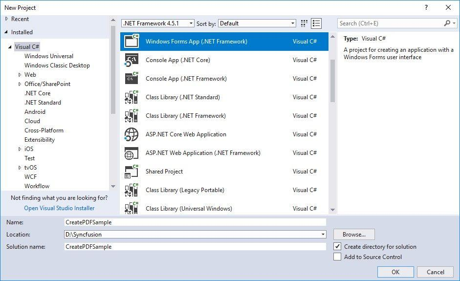
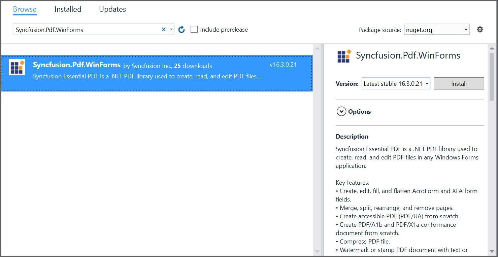
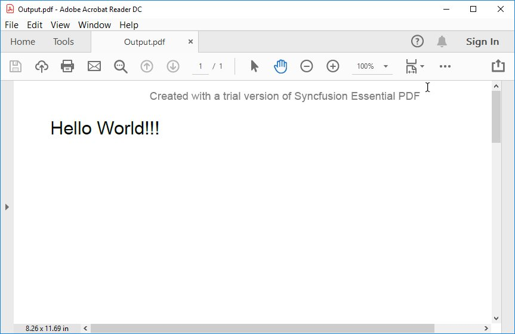
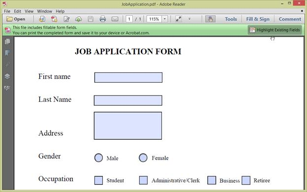

---
title: Syncfusion PDF control for Windows Forms | Syncfusion
description: Loading and saving the PDF document in Windows Forms platform
platform: file-formats
control: PDF
documentation: UG
--- 

# Working with Windows Forms

In your Windows Forms application, add the required assemblies to use Essential PDF. [Refer here for assemblies required](/File-Formats/PDF/Assemblies-Required).

## Steps to create PDF document in Window Forms:

Create a new Windows Forms application project.

Install the [Syncfusion.Pdf.WinForms](https://www.nuget.org/packages/Syncfusion.Pdf.WinForms/) NuGet package as a reference to your  .NET Framework applications from [NuGet.org](https://www.nuget.org/).

Include the following namespaces in the **Form1.Designer.cs** file.



using Syncfusion.Pdf;
using Syncfusion.Pdf.Graphics;
using System.Drawing;



Add a new button in **Form1.Designer.cs** to create PDF document as follows.



private Button btnCreate;
private Label label;
  
private void InitializeComponent()
{
  btnCreate = new Button();
  label = new Label();
  
  //Label
  label.Location = new System.Drawing.Point(0, 40);
  label.Size = new System.Drawing.Size(426, 35);
  label.Text = "Click the button to generate PDF file by Essential PDF";
  label.TextAlign = System.Drawing.ContentAlignment.MiddleCenter;
  
  //Button
  btnCreate.Location = new System.Drawing.Point(180, 110);
  btnCreate.Size = new System.Drawing.Size(85, 26);
  btnCreate.Text = "Create PDF";
  btnCreate.Click += new EventHandler(btnCreate_Click); 
                               
  //Create PDF
  ClientSize = new System.Drawing.Size(450, 150);
  Controls.Add(label);
  Controls.Add(btnCreate);
  Text = "Create PDF";
}



Create the **btnCreate_Click** event and add the following code in btnCreate_Click to create PDF file with simple text.


 
using (PdfDocument document = new PdfDocument())
{
  //Add a page to the document
  PdfPage page = document.Pages.Add();

  //Create PDF graphics for a page
  PdfGraphics graphics = page.Graphics;

  //Set the standard font
  PdfFont font = new PdfStandardFont(PdfFontFamily.Helvetica, 20);

  //Draw the text
  graphics.DrawString("Hello World!!!", font, PdfBrushes.Black, new PointF(0, 0));

  //Save the document
  document.Save("Output.pdf");
}



A complete working sample can be downloaded from [Create-PDF-file.zip](http://www.syncfusion.com/downloads/support/directtrac/general/ze/CreatePDFSample-123272332 )

By executing the program, you will get the PDF document as follows.

## Creating a PDF document with image

The following code example shows how to create a PDF document with an image.



//Create a new PDF document.
PdfDocument doc = new PdfDocument();
//Add a page to the document.
PdfPage page = doc.Pages.Add();
//Create PDF graphics for the page
PdfGraphics graphics = page.Graphics;
//Load the image from the disk.
PdfBitmap image = new PdfBitmap("Autumn Leaves.jpg");
//Draw the image
graphics.DrawImage(image, 0, 0);
//Save the document.
doc.Save("Output.pdf");
//Close the document.
doc.Close(true);



## Creating a PDF document with table

The following code example shows how to create a PDF document with a simple table.



//Create a new PDF document.
PdfDocument doc = new PdfDocument();
//Add a page.
PdfPage page = doc.Pages.Add();
//Create a PdfGrid.
PdfGrid pdfGrid = new PdfGrid();
//Create a DataTable.
DataTable dataTable = new DataTable();
//Add columns to the DataTable
dataTable.Columns.Add("ID");
dataTable.Columns.Add("Name");
//Add rows to the DataTable.
dataTable.Rows.Add(new object[] { "E01", "Clay" });
dataTable.Rows.Add(new object[] { "E02", "Thomas" });
dataTable.Rows.Add(new object[] { "E03", "Andrew" });
dataTable.Rows.Add(new object[] { "E04", "Paul" });
dataTable.Rows.Add(new object[] { "E05", "Gary" });
//Assign data source.
pdfGrid.DataSource = dataTable;
//Draw grid to the page of PDF document.
pdfGrid.Draw(page, new PointF(10, 10));
//Save the document.
doc.Save("Output.pdf");
//close the document
doc.Close(true);



## Creating a simple PDF document with basic elements
The PdfDocument object represents an entire PDF document that is being created. The following code example shows how to create a PDF document and add a page to it along with the page settings.



//Creates a new PDF document
PdfDocument document = new PdfDocument();
//Adds page settings
document.PageSettings.Orientation = PdfPageOrientation.Landscape;
document.PageSettings.Margins.All = 50;
//Adds a page to the document
PdfPage page = document.Pages.Add();
PdfGraphics graphics = page.Graphics;



1. Essential PDF has APIs similar to the .NET GDI plus which helps to draw elements to the PDF page just like 2D drawing in .NET. 
2. Unlike System.Drawing APIs all the units are measured in point instead of pixel. 
3. In PDF, all the elements are placed in absolute positions and has the possibility for content overlapping if misplaced. 
4. Essential PDF provides the rendered bounds for each and every elements added through PdfLayoutResult objects. This can be used to add successive elements and prevent content overlap.

The following code example explains how to add an image from disk to a PDF document, by providing the rectangle coordinates. 



//Loads the image from disk
PdfImage image = PdfImage.FromFile("AdventureCycle.jpg");
RectangleF bounds = new RectangleF(176, 0, 390, 130);
//Draws the image to the PDF page
page.Graphics.DrawImage(image, bounds);



The following methods can be used to add text to a PDF document.

1. DrawString() method of the PdfGraphics
2. PdfTextElement class.

The PdfTextElement provides the layout result of the added text by using the location of the next element that decides to prevent content overlapping. This is not available in the DrawString method. 

The following code example adds the necessary text such as address, invoice number and date to create a basic invoice application. 
 


PdfBrush solidBrush = new PdfSolidBrush(new PdfColor(126, 151, 173));
bounds = new RectangleF(0, bounds.Bottom + 90, graphics.ClientSize.Width, 30);
//Draws a rectangle to place the heading in that region.
graphics.DrawRectangle(solidBrush, bounds);
//Creates a font for adding the heading in the page
PdfFont subHeadingFont = new PdfStandardFont(PdfFontFamily.TimesRoman, 14);
//Creates a text element to add the invoice number
PdfTextElement element = new PdfTextElement("INVOICE " + id.ToString(), subHeadingFont);
element.Brush = PdfBrushes.White;

//Draws the heading on the page
PdfLayoutResult result = element.Draw(page, new PointF(10, bounds.Top + 8));
string currentDate = "DATE " + DateTime.Now.ToString("MM/dd/yyyy");
//Measures the width of the text to place it in the correct location
SizeF textSize = subHeadingFont.MeasureString(currentDate);
PointF textPosition = new PointF(graphics.ClientSize.Width - textSize.Width - 10, result.Bounds.Y);
//Draws the date by using DrawString method
graphics.DrawString(currentDate, subHeadingFont, element.Brush, textPosition);
PdfFont timesRoman = new PdfStandardFont(PdfFontFamily.TimesRoman, 10);
//Creates text elements to add the address and draw it to the page.
element = new PdfTextElement("BILL TO ", timesRoman);
element.Brush = new PdfSolidBrush(new PdfColor(126, 155, 203));
result = element.Draw(page, new PointF(10, result.Bounds.Bottom + 25));
PdfPen linePen = new PdfPen(new PdfColor(126, 151, 173), 0.70f);
PointF startPoint = new PointF(0, result.Bounds.Bottom + 3);
PointF endPoint = new PointF(graphics.ClientSize.Width, result.Bounds.Bottom + 3);
//Draws a line at the bottom of the address
graphics.DrawLine(linePen, startPoint, endPoint);



Essential PDF provides two types of table models. The difference between both the table models can be referred from the link 
[Difference between PdfLightTable and PdfGrid](/file-formats/pdf/working-with-tables#difference-between-pdflighttable-and-pdfgrid "difference-between-pdflighttable-and-pdfgrid")

Since the invoice document requires only simple cell customizations, the given code example explains how to create a simple invoice table by using PdfGrid.
 


//Creates the datasource for the table
DataTable invoiceDetails = GetProductDetailsAsDataTable();
//Creates a PDF grid
PdfGrid grid = new PdfGrid();
//Adds the data source
grid.DataSource = invoiceDetails;
//Creates the grid cell styles
PdfGridCellStyle cellStyle = new PdfGridCellStyle();
cellStyle.Borders.All = PdfPens.White;
PdfGridRow header = grid.Headers[0];
//Creates the header style
PdfGridCellStyle headerStyle = new PdfGridCellStyle();
headerStyle.Borders.All = new PdfPen(new PdfColor(126, 151, 173));
headerStyle.BackgroundBrush = new PdfSolidBrush(new PdfColor(126, 151, 173));
headerStyle.TextBrush = PdfBrushes.White;
headerStyle.Font = new PdfStandardFont(PdfFontFamily.TimesRoman, 14f, PdfFontStyle.Regular);

//Adds cell customizations
for (int i = 0; i < header.Cells.Count; i++)
{
  if (i == 0 || i == 1)
    header.Cells[i].StringFormat = new PdfStringFormat(PdfTextAlignment.Left, PdfVerticalAlignment.Middle);
  else
    header.Cells[i].StringFormat = new PdfStringFormat(PdfTextAlignment.Right, PdfVerticalAlignment.Middle);
}

//Applies the header style
header.ApplyStyle(headerStyle);
cellStyle.Borders.Bottom = new PdfPen(new PdfColor(217, 217, 217), 0.70f);
cellStyle.Font = new PdfStandardFont(PdfFontFamily.TimesRoman, 12f);
cellStyle.TextBrush = new PdfSolidBrush(new PdfColor(131, 130, 136));
//Creates the layout format for grid
PdfGridLayoutFormat layoutFormat = new PdfGridLayoutFormat();
// Creates layout format settings to allow the table pagination
layoutFormat.Layout = PdfLayoutType.Paginate;
//Draws the grid to the PDF page.
PdfGridLayoutResult gridResult = grid.Draw(page, new RectangleF(new PointF(0, result.Bounds.Bottom + 40), new SizeF(graphics.ClientSize.Width, graphics.ClientSize.Height - 100)), layoutFormat);



The following code example shows how to save the invoice document to disk and dispose the PdfDocument object.
 


//Saves and closes the document.
document.Save("Sample.pdf");
document.Close(true);



The following screenshot shows the invoice PDF document created by using Essential PDF.

## Filling forms

An interactive form, sometimes referred to as an AcroForm is a collection of fields for gathering information interactively from the user. A PDF document can contain any number of fields appearing in any combination of pages, all of that make a single, globally interactive form spanning the entire document.

Essential PDF allows you to create and manipulate existing form in PDF document. To work with existing form documents, the following namespaces are required.

1. Syncfusion.Pdf
2. Syncfusion.Pdf.Parsing

The following guide shows how to fill a sample PDF form as shown.

Essential PDF allows you to fill the form fields by using PdfLoadedField class. You can get the form field either by using its field name or field index.



//Loads the PDF form.
PdfLoadedDocument loadedDocument = new PdfLoadedDocument(@"JobApplication.pdf");
//Loads the form
PdfLoadedForm form = loadedDocument.Form;
//Fills the textbox field by using index
(form.Fields[0] as PdfLoadedTextBoxField).Text = "John";
//Fills the textbox fields by using field name
(form.Fields["LastName"] as PdfLoadedTextBoxField).Text = "Doe";
(form.Fields["Address"] as PdfLoadedTextBoxField).Text = " John Doe \n 123 Main St \n Anytown, USA";
//Loads the radio button group
PdfLoadedRadioButtonItemCollection radioButtonCollection = (form.Fields["Gender"] as PdfLoadedRadioButtonListField).Items;
//Checks the 'Male' option
radioButtonCollection[0].Checked = true;
//Checks the 'business' checkbox field
(form.Fields["Business"] as PdfLoadedCheckBoxField).Checked = true;
//Checks the 'retiree' checkbox field
(form.Fields["Retiree"] as PdfLoadedCheckBoxField).Checked = true;
//Saves and closes the document
loadedDocument.Save("Output.pdf");
loadedDocument.Close(true);



The filled form is shown in adobe reader application as follows.

## Merge PDF Documents

Essential PDF supports merging multiple PDF documents from disk and stream. You can merge the multiple PDF document from disk by specifying the path of the documents in a string array.

Refer to the following code example to merge multiple documents from disk.
 


//Creates the new PDF document
PdfDocument finalDoc = new PdfDocument();
// Creates a string array of source files to be merged.
string[] source = { "file1.pdf, file2.pdf" };
// Merges PDFDocument.
PdfDocument.Merge(finalDoc, source);
//Saves the final document
finalDoc.Save("Sample.pdf");
//closes the document
finalDoc.Close(true);



You can merge the PDF document streams by using the following code example.



//Creates the destination document
PdfDocument finalDoc = new PdfDocument();
Stream stream1 = File.OpenRead("file1.pdf");
Stream stream2 = File.OpenRead("file2.pdf");
// Creates a PDF stream for merging.
Stream[] streams = { stream1, stream2 };
// Merges PDFDocument.
PdfDocumentBase.Merge(finalDoc, streams);
//Saves the document
finalDoc.Save("sample.pdf");
//closes the document
finalDoc.Close(true);



