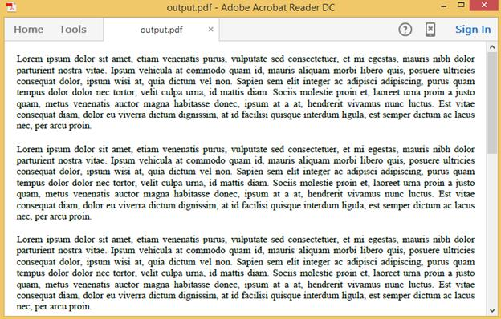
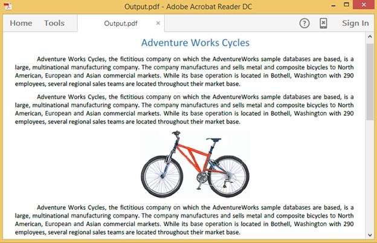
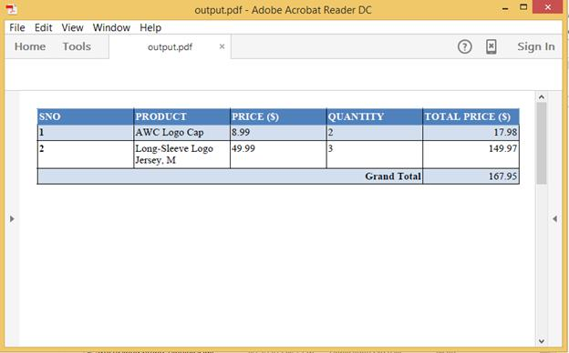

# Working with flow layout

PDF documents can be created using flow model instead of adding elements through absolute positioning. To create a PDF document in flow model, please add references to the following set of assemblies. 
<table>
<tr>
<th>
Assembly Name </th><th>
Description </th></tr>
<tr>
<td>
Syncfusion.Pdf.Base </td><td>
This assembly contains the core feature for creating, manipulating and saving PDF documents. </td></tr>
<tr>
<td>
Syncfusion.Compression.Base </td><td>
This assembly is required for compressing the internal contents of a PDF document. </td></tr>
<tr>
<td>
Syncfusion.DocIO.Base </td><td>
This assembly contains the core features needed for creating, reading, manipulating a Word document. </td></tr>
<tr>
<td>
Syncfusion.DocToPdfConverter.Base </td><td>
This assembly is required for converting word to PDF </td></tr>
</table>
Include the following namespaces in your .cs or .vb file as shown below.


using Syncfusion.Pdf;
using Syncfusion.DocIO.DLS;
using Syncfusion.DocToPDFConverter;



Imports Syncfusion.Pdf
Imports Syncfusion.DocIO.DLS
Imports Syncfusion.DocToPDFConverter



## Working with Text

You can create a PDF document with multiple paragraph text using flow model with the following code snippet.



//Creates a new Word document 
WordDocument wordDocument = new WordDocument();
//Adds new section with single paragraph to the document
wordDocument.EnsureMinimal();
wordDocument.LastSection.PageSetup.Margins.All = 15;
//Get Last paragraph of the document
IWParagraph paragraph = wordDocument.LastParagraph;
//Create a custom style
WParagraphStyle paragraphStyle = wordDocument.Styles.FindByName("Normal") as WParagraphStyle;
paragraphStyle.CharacterFormat.Font = new Font("Times New Roman", 12);
paragraphStyle.ParagraphFormat.HorizontalAlignment = HorizontalAlignment.Justify;
paragraphStyle.ParagraphFormat.AfterSpacing = 15f;
WSection section = wordDocument.LastSection;
string text = "Lorem ipsum dolor sit amet, etiam venenatis purus, vulputate sed consectetuer, et mi egestas, mauris nibh dolor parturient nostra vitae. Ipsum vehicula at commodo quam id, mauris aliquam morbi libero quis, posuere ultricies consequat dolor, ipsum wisi at, quia dictum vel non. Sapien sem elit integer ac adipisci adipiscing, purus quam tempus dolor dolor nec tortor, velit culpa urna, id mattis diam. Sociis molestie proin et, laoreet urna proin a justo quam, metus venenatis auctor magna habitasse donec, ipsum at a at, hendrerit vivamus nunc luctus. Est vitae consequat diam, dolor eu viverra dictum dignissim, at id facilisi quisque interdum ligula, est semper dictum ac lacus nec, per arcu proin.";
//Adds new text to the paragraph
paragraph.AppendText(text);
//Adds first text to the paragraph
paragraph = section.AddParagraph();
paragraph.AppendText(text);
//Second paragraph
paragraph = section.AddParagraph();
paragraph.AppendText(text);
//Creates an instance of the DocToPDFConverter
DocToPDFConverter converter = new DocToPDFConverter();
//Converts Word document into PDF document
PdfDocument pdfDocument = converter.ConvertToPDF(wordDocument);
//Save and close the PDF document 
pdfDocument.Save("Output.pdf");
pdfDocument.Close(true);
//Close the document
wordDocument.Close();



'Creates a new Word document 
Dim wordDocument As New WordDocument()
'Adds new section with single paragraph to the document
wordDocument.EnsureMinimal()
wordDocument.LastSection.PageSetup.Margins.All = 15
'Get Last paragraph of the document
Dim paragraph As IWParagraph = wordDocument.LastParagraph
'Create a custom style
Dim paragraphStyle As WParagraphStyle = TryCast(wordDocument.Styles.FindByName("Normal"), WParagraphStyle)
paragraphStyle.CharacterFormat.Font = New Font("Times New Roman", 12)
paragraphStyle.ParagraphFormat.HorizontalAlignment = HorizontalAlignment.Justify
paragraphStyle.ParagraphFormat.AfterSpacing = 15F
Dim section As WSection = wordDocument.LastSection
Dim text As String = "Lorem ipsum dolor sit amet, etiam venenatis purus, vulputate sed consectetuer, et mi egestas, mauris nibh dolor parturient nostra vitae. Ipsum vehicula at commodo quam id, mauris aliquam morbi libero quis, posuere ultricies consequat dolor, ipsum wisi at, quia dictum vel non. Sapien sem elit integer ac adipisci adipiscing, purus quam tempus dolor dolor nec tortor, velit culpa urna, id mattis diam. Sociis molestie proin et, laoreet urna proin a justo quam, metus venenatis auctor magna habitasse donec, ipsum at a at, hendrerit vivamus nunc luctus. Est vitae consequat diam, dolor eu viverra dictum dignissim, at id facilisi quisque interdum ligula, est semper dictum ac lacus nec, per arcu proin."
'Adds new text to the paragraph
paragraph.AppendText(text)
'Adds first text to the paragraph
paragraph = section.AddParagraph()
paragraph.AppendText(text)
'Second paragraph
paragraph = section.AddParagraph()
paragraph.AppendText(text)
'Creates an instance of the DocToPDFConverter
Dim converter As New DocToPDFConverter()
'Converts Word document into PDF document
Dim pdfDocument As PdfDocument = converter.ConvertToPDF(wordDocument)
'Save and close the PDF document 
pdfDocument.Save("Output.pdf")
pdfDocument.Close(True)
'Close the document
wordDocument.Close()



The following image shows the PDF document with multiple paragraphs created using the flow model.

## Working with text and images

You can create PDF document with text and image using the following code snippet.



//A new document is created.
WordDocument document = new WordDocument();
//Adding a new section to the document.
WSection section = document.AddSection() as WSection;
//Set Margin of the section
section.PageSetup.Margins.All = 20;

//Create Paragraph styles
WParagraphStyle style = document.AddParagraphStyle("Normal") as WParagraphStyle;
style.CharacterFormat.FontName = "Calibri";
style.ParagraphFormat.HorizontalAlignment = Syncfusion.DocIO.DLS.HorizontalAlignment.Justify;
style.CharacterFormat.FontSize = 11f;
style.ParagraphFormat.AfterSpacing = 8;
style.ParagraphFormat.FirstLineIndent = 36f;

style = document.AddParagraphStyle("Heading 1") as WParagraphStyle;
style.ApplyBaseStyle("Normal");
style.CharacterFormat.FontName = "Calibri Light";
style.CharacterFormat.FontSize = 16f;
style.CharacterFormat.TextColor = Color.FromArgb(46, 116, 181);
//Appends paragraph.
IWParagraph paragraph = section.AddParagraph();
paragraph.ApplyStyle("Heading 1");
paragraph.ParagraphFormat.HorizontalAlignment = Syncfusion.DocIO.DLS.HorizontalAlignment.Center;
paragraph.ParagraphFormat.AfterSpacing = 10;
WTextRange textRange = paragraph.AppendText("Adventure Works Cycles") as WTextRange;
textRange.CharacterFormat.FontSize = 18f;
textRange.CharacterFormat.FontName = "Calibri";
string text =
"Adventure Works Cycles, the fictitious company on which the AdventureWorks sample databases are based, is a large, multinational manufacturing company. The company manufactures and sells metal and composite bicycles to North American, European and Asian commercial markets. While its base operation is located in Bothell, Washington with 290 employees, several regional sales teams are located throughout their market base.";
//Appends paragraph.
paragraph = section.AddParagraph();
textRange = paragraph.AppendText(text) as WTextRange;

paragraph = section.AddParagraph();
textRange = paragraph.AppendText(text) as WTextRange;
//Add image to the paragraph
paragraph = section.AddParagraph();
paragraph.ParagraphFormat.HorizontalAlignment = Syncfusion.DocIO.DLS.HorizontalAlignment.Center;
paragraph.AppendPicture(Image.FromFile("Mountain-200.jpg"));

//Appends paragraph.
paragraph = section.AddParagraph();
textRange = paragraph.AppendText(text) as WTextRange;
//Creates an instance of the DocToPDFConverter
DocToPDFConverter converter = new DocToPDFConverter();
//Converts Word document into PDF document
PdfDocument pdfDocument = converter.ConvertToPDF(document);
//Saves the PDF file 
pdfDocument.Save("Sample.pdf");
pdfDocument.Close(true);
document.Close();



'A new document is created.
Dim document As New WordDocument()
'Adding a new section to the document.
Dim section As WSection = TryCast(document.AddSection(), WSection)
'Set Margin of the section
section.PageSetup.Margins.All = 20
'Create Paragraph styles
Dim style As WParagraphStyle = TryCast(document.AddParagraphStyle("Normal"), WParagraphStyle)
style.CharacterFormat.FontName = "Calibri"
style.ParagraphFormat.HorizontalAlignment = Syncfusion.DocIO.DLS.HorizontalAlignment.Justify
style.CharacterFormat.FontSize = 11F
style.ParagraphFormat.AfterSpacing = 8
style.ParagraphFormat.FirstLineIndent = 36F
style = TryCast(document.AddParagraphStyle("Heading 1"), WParagraphStyle)
style.ApplyBaseStyle("Normal")
style.CharacterFormat.FontName = "Calibri Light"
style.CharacterFormat.FontSize = 16F
style.CharacterFormat.TextColor = Color.FromArgb(46, 116, 181)
'Appends paragraph.
Dim paragraph As IWParagraph = section.AddParagraph()
paragraph.ApplyStyle("Heading 1")
paragraph.ParagraphFormat.HorizontalAlignment = Syncfusion.DocIO.DLS.HorizontalAlignment.Center
paragraph.ParagraphFormat.AfterSpacing = 10
Dim textRange As WTextRange = TryCast(paragraph.AppendText("Adventure Works Cycles"), WTextRange)
textRange.CharacterFormat.FontSize = 18F
textRange.CharacterFormat.FontName = "Calibri"
Dim text As String = "Adventure Works Cycles, the fictitious company on which the AdventureWorks sample databases are based, is a large, multinational manufacturing company. The company manufactures and sells metal and composite bicycles to North American, European and Asian commercial markets. While its base operation is located in Bothell, Washington with 290 employees, several regional sales teams are located throughout their market base."
'Appends paragraph.
paragraph = section.AddParagraph()
textRange = TryCast(paragraph.AppendText(text), WTextRange)
paragraph = section.AddParagraph()
textRange = TryCast(paragraph.AppendText(text), WTextRange)
'Add image to the paragraph
paragraph = section.AddParagraph()
paragraph.ParagraphFormat.HorizontalAlignment = Syncfusion.DocIO.DLS.HorizontalAlignment.Center
paragraph.AppendPicture(Image.FromFile("Mountain-200.jpg"))
'Appends paragraph.
paragraph = section.AddParagraph()
textRange = TryCast(paragraph.AppendText(text), WTextRange)
'Creates an instance of the DocToPDFConverter
Dim converter As New DocToPDFConverter()
'Converts Word document into PDF document
Dim pdfDocument As PdfDocument = converter.ConvertToPDF(document)
'Saves the PDF file 
pdfDocument.Save("Sample.pdf")
pdfDocument.Close(True)
document.Close()



The following image shows the PDF document with multiple paragraphs and image created using the flow model.

## Working with table

You can create PDF document with simple table using the following code snippet.


//Creates a new Word document 
WordDocument worddocument = new WordDocument();
//Adding a new section to the document.
WSection section = worddocument.AddSection() as WSection;
//Set Margin of the section
section.PageSetup.Margins.All = 20;
// Adding a new Table
WTable table = section.AddTable() as WTable;
table.TableFormat.Paddings.All = 2;
table.TableFormat.Borders.BorderType = Syncfusion.DocIO.DLS.BorderStyle.Single;
// Inserting rows to the table.
table.ResetCells(4, 5);

//Appends paragraph with header.
IWParagraph paragraph = table[0, 0].AddParagraph();
paragraph.AppendText("SNO");
paragraph = table[0, 1].AddParagraph();
paragraph.AppendText("PRODUCT");
paragraph = table[0, 2].AddParagraph();
paragraph.AppendText("PRICE ($)");
paragraph = table[0, 3].AddParagraph();
paragraph.AppendText("QUANTITY");
paragraph = table[0, 4].AddParagraph();
paragraph.AppendText("TOTAL PRICE ($)");
//Add the first item
paragraph = table[1, 0].AddParagraph();
paragraph.AppendText("1");
paragraph = table[1, 1].AddParagraph();
paragraph.AppendText("AWC Logo Cap");
paragraph = table[1, 2].AddParagraph();
paragraph.AppendText("8.99");
paragraph = table[1, 3].AddParagraph();
paragraph.AppendText("2");
paragraph = table[1, 4].AddParagraph();
paragraph.ParagraphFormat.HorizontalAlignment = HorizontalAlignment.Right;
paragraph.AppendText("17.98");
//Add the second item
paragraph = table[2, 0].AddParagraph();
paragraph.AppendText("2");
paragraph = table[2, 1].AddParagraph();
paragraph.AppendText("Long-Sleeve Logo Jersey, M");
paragraph = table[2, 2].AddParagraph();
paragraph.AppendText("49.99");
paragraph = table[2, 3].AddParagraph();
paragraph.AppendText("3");
paragraph = table[2, 4].AddParagraph();
paragraph.ParagraphFormat.HorizontalAlignment = HorizontalAlignment.Right;
paragraph.AppendText("149.97");
// Table formatting with cell merging.
table[3,0].CellFormat.HorizontalMerge = CellMerge.Start;
table[3, 1].CellFormat.HorizontalMerge = CellMerge.Continue;
table[3, 2].CellFormat.HorizontalMerge = CellMerge.Continue;
table[3, 3].CellFormat.HorizontalMerge = CellMerge.Continue;
paragraph = table[3, 0].AddParagraph();
paragraph.ParagraphFormat.HorizontalAlignment = HorizontalAlignment.Right;
paragraph.AppendText("Grand Total");
paragraph = table[3, 4].AddParagraph();
paragraph.ParagraphFormat.HorizontalAlignment = HorizontalAlignment.Right;
paragraph.AppendText("167.95");

//Apply built-in table style to the table.
table.ApplyStyle(BuiltinTableStyle.MediumShading1Accent1);

//Creates an instance of the DocToPDFConverter
DocToPDFConverter converter = new DocToPDFConverter();
//Converts Word document into PDF document
PdfDocument pdfDocument = converter.ConvertToPDF(worddocument);
//Save and close the PDF document 
pdfDocument.Save("Output.pdf");
pdfDocument.Close(true);
//Close the document
worddocument.Close();



'Creates a new Word document 
Dim worddocument As New WordDocument()
'Adding a new section to the document.
Dim section As WSection = TryCast(worddocument.AddSection(), WSection)
'Set Margin of the section
section.PageSetup.Margins.All = 20
' Adding a new Table
Dim table As WTable = TryCast(section.AddTable(), WTable)
table.TableFormat.Paddings.All = 2
table.TableFormat.Borders.BorderType = Syncfusion.DocIO.DLS.BorderStyle.[Single]
' Inserting rows to the table.
table.ResetCells(4, 5)
'Appends paragraph with header.
Dim paragraph As IWParagraph = table(0, 0).AddParagraph()
paragraph.AppendText("SNO")
paragraph = table(0, 1).AddParagraph()
paragraph.AppendText("PRODUCT")
paragraph = table(0, 2).AddParagraph()
paragraph.AppendText("PRICE ($)")
paragraph = table(0, 3).AddParagraph()
paragraph.AppendText("QUANTITY")
paragraph = table(0, 4).AddParagraph()
paragraph.AppendText("TOTAL PRICE ($)")
'Add the first item
paragraph = table(1, 0).AddParagraph()
paragraph.AppendText("1")
paragraph = table(1, 1).AddParagraph()
paragraph.AppendText("AWC Logo Cap")
paragraph = table(1, 2).AddParagraph()
paragraph.AppendText("8.99")
paragraph = table(1, 3).AddParagraph()
paragraph.AppendText("2")
paragraph = table(1, 4).AddParagraph()
paragraph.ParagraphFormat.HorizontalAlignment = HorizontalAlignment.Right
paragraph.AppendText("17.98")
'Add the second item
paragraph = table(2, 0).AddParagraph()
paragraph.AppendText("2")
paragraph = table(2, 1).AddParagraph()
paragraph.AppendText("Long-Sleeve Logo Jersey, M")
paragraph = table(2, 2).AddParagraph()
paragraph.AppendText("49.99")
paragraph = table(2, 3).AddParagraph()
paragraph.AppendText("3")
paragraph = table(2, 4).AddParagraph()
paragraph.ParagraphFormat.HorizontalAlignment = HorizontalAlignment.Right
paragraph.AppendText("149.97")
' Table formatting with cell merging.
table(3, 0).CellFormat.HorizontalMerge = CellMerge.Start
table(3, 1).CellFormat.HorizontalMerge = CellMerge.[Continue]
table(3, 2).CellFormat.HorizontalMerge = CellMerge.[Continue]
table(3, 3).CellFormat.HorizontalMerge = CellMerge.[Continue]
paragraph = table(3, 0).AddParagraph()
paragraph.ParagraphFormat.HorizontalAlignment = HorizontalAlignment.Right
paragraph.AppendText("Grand Total")
paragraph = table(3, 4).AddParagraph()
paragraph.ParagraphFormat.HorizontalAlignment = HorizontalAlignment.Right
paragraph.AppendText("167.95")
'Apply built-in table style to the table.
table.ApplyStyle(BuiltinTableStyle.MediumShading1Accent1)
'Creates an instance of the DocToPDFConverter
Dim converter As New DocToPDFConverter()
'Converts Word document into PDF document
Dim pdfDocument As PdfDocument = converter.ConvertToPDF(worddocument)
'Save and close the PDF document 
pdfDocument.Save("Output.pdf")
pdfDocument.Close(True)
'Close the document
worddocument.Close()



The following image shows the PDF document with simple table created using the flow model.

