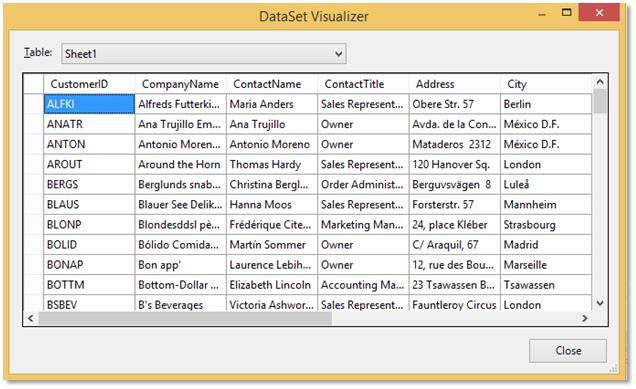
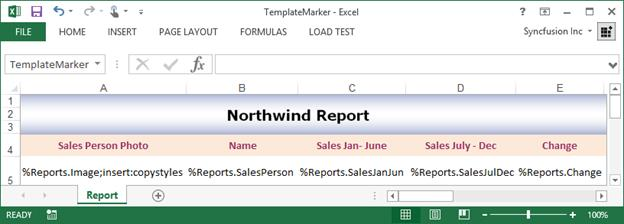
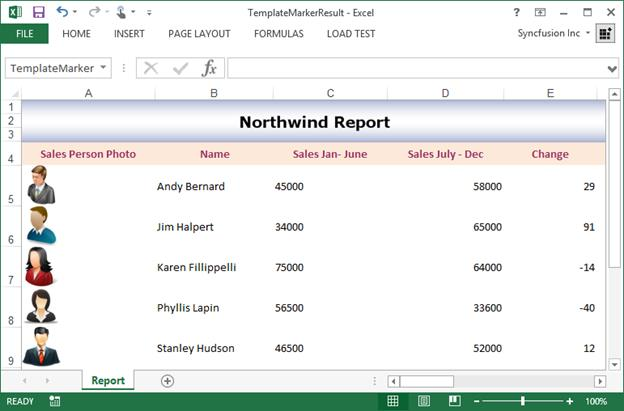

# Getting Started

## Create a simple Excel Document

This section explains how to create a simple Excel document using Essential XlsIO. The following assemblies must be referred in your application to create and manipulate Excel document.

<table>
<thead>
<tr>
<th>
Assembly Name   </th><th>
Description  </th></tr>
</thead>
<tbody>
<tr>
<td>
Syncfusion.XlsIO.Base  </td><td>
This assembly contains the core features needed for creating, reading, manipulating an Excel file.  </td></tr>
<tr>
<td>
Syncfusion.Compression.Base  </td><td>
This assembly is used to package the Workbook contents.  </td></tr>
</tbody>
</table>
Include the following namespaces in your .cs or .vb file as shown below

  

using Syncfusion.XlsIO;




Imports Syncfusion.XlsIO


  

An instance of ExcelEngine gives access to create an application instance which will be similar to launching Microsoft Excel application. The following code snippet shows how to initialize the application object for creating or manipulating Excel documents.

  

//New instance of ExcelEngine is created 

//Equivalent to launching Microsoft Excel with no workbooks open

//Instantiate the spreadsheet creation engine

ExcelEngine excelEngine = new ExcelEngine();

//Instantiate the Excel application object

IApplication application = excelEngine.Excel;




'New instance of ExcelEngine is created

'Equivalent to launching Microsoft Excel with no workbooks open

'Instantiate the spreadsheet creation engine

Dim excelEngine As ExcelEngine = New ExcelEngine()

'Instantiate the Excel application object

Dim application As IApplication = excelEngine.Excel


  

By default, Excel version associated with application object is Excel 97 to 2003 (*.xls). XlsIO writes the excel file in the respective format depending upon this excel version. You can modify the default Excel version to Excel 2013 as shown below.

  

//Assigns default application version

application.DefaultVersion = ExcelVersion.Excel2013;




'Assigns default application version

application.DefaultVersion = ExcelVersion.Excel2013


  

Workbook contains a collection of worksheets and various workbook-level properties. Each worksheet contains cells, which in turn, can contain text, numbers, dates, formula etc. The code snippet illustrates how to create a workbook and access worksheet instance.

  

//A new workbook is created. 

//Equivalent to creating a new workbook in Excel.

//Create a workbook with 1 worksheet.

IWorkbook workbook = application.Workbooks.Create(1);

//Access a worksheet from workbook.

IWorksheet worksheet = workbook.Worksheets[0];




'A new workbook is created. 

'Equivalent to creating a new workbook in Excel.

'Create a workbook with 1 worksheet.

Dim workbook As IWorkbook = application.Workbooks.Create(1)

'Access a worksheet from workbook.

Dim worksheet As IWorksheet = workbook.Worksheets[0]


  

  

//Adding text data

worksheet.Range["A1"].Text = "Month";

worksheet.Range["B1"].Text = "Sales";

worksheet.Range["A6"].Text = "Total";

//Adding DateTime data

worksheet.Range["A2"].DateTime = new DateTime(2015, 1, 10);

worksheet.Range["A3"].DateTime = new DateTime(2015, 2, 10);

worksheet.Range["A4"].DateTime = new DateTime(2015, 3, 10);

//Applying number format for date value cells A2 to A4

worksheet.Range["A2:A4"].NumberFormat = "mmmm, yyyy";

//Auto-size the first column to fit the content

worksheet.AutofitColumn(1);

//Adding numeric data

worksheet.Range["B2"].Number = 68878;

worksheet.Range["B3"].Number = 71550;

worksheet.Range["B4"].Number = 72808;

//Adding formula

worksheet.Range["B6"].Formula = "SUM(B2:B4)";




'Adding text data

worksheet.Range("A1").Text = "Month"

worksheet.Range("B1").Text = "Sales"

worksheet.Range("A6").Text = "Total"

'Adding DateTime data

worksheet.Range["A2"].DateTime = new DateTime(2015, 1, 10)

worksheet.Range["A3"].DateTime = new DateTime(2015, 2, 10)

worksheet.Range["A4"].DateTime = new DateTime(2015, 3, 10)

'Applying number format for date value cells A2 to A4

worksheet.Range["A2:A4"].NumberFormat = "mmmm, yyyy"

'Auto-size the first column to fit the content

worksheet.AutofitColumn(1)

'Adding numeric data

worksheet.Range("B2").Number = 68878

worksheet.Range("B3").Number = 71550

worksheet.Range("B4").Number = 72808

'Adding formula

worksheet.Range["B6"].Formula = "SUM(B2:B4)"


  

The following code snippet shows how to add an image into the worksheet.

  

//Inserting image

worksheet.Pictures.AddPicture(10, 2, "image.jpg");




'Inserting image

worksheet.Pictures.AddPicture(10, 2, "image.jpg")


  

Finally, save the document in file system and close/dispose the instance of IWorkbook and ExcelEngine.

  

// Saving the workbook to disk in xlsx format

workbook.SaveAs("Sample.xlsx");

// Closing the workbook.

workbook.Close();

// Dispose the Excel engine

excelEngine.Dispose();




'Saving the workbook to disk in xlsx format

workbook.SaveAs("Sample.xlsx")

'Closing the workbook.

workbook.Close()

'Dispose the Excel engine

excelEngine.Dispose()


  

The complete code to create a simple Excel document.

  

using Syncfusion.XlsIO;

namespace ExcelCreation

{

class Program

{

static void Main(string[] args)

{

//New instance of ExcelEngine is created 

//Equivalent to launching Excel with no workbooks open

//Instantiate the spreadsheet creation engine

ExcelEngine excelEngine = new ExcelEngine();

// Instantiate the Excel application object

IApplication application = excelEngine.Excel;

// Assigns default application version

application.DefaultVersion = ExcelVersion.Excel2013;

//A new workbook is created. 

//Equivalent to creating a new workbook in Excel.

//Create a workbook with 1 worksheet.

IWorkbook workbook = application.Workbooks.Create(1);

//Access a worksheet from workbook.

IWorksheet worksheet = workbook.Worksheets[0];

//Adding text data

worksheet.Range["A1"].Text = "Month";

worksheet.Range["B1"].Text = "Sales";

worksheet.Range["A6"].Text = "Total";

//Adding DateTime data

worksheet.Range["A2"].DateTime = new DateTime(2015, 1, 10);

worksheet.Range["A3"].DateTime = new DateTime(2015, 2, 10);

worksheet.Range["A4"].DateTime = new DateTime(2015, 3, 10);

//Applying number format for date value cells A2 to A4

worksheet.Range["A2:A4"].NumberFormat = "mmmm, yyyy";

//Auto-size the first column to fit the content

worksheet.AutofitColumn(1);

//Adding numeric data

worksheet.Range["B2"].Number = 68878;

worksheet.Range["B3"].Number = 71550;

worksheet.Range["B4"].Number = 72808;

//Adding formula

worksheet.Range["B6"].Formula = "SUM(B2:B4)";

//Inserting image

worksheet.Pictures.AddPicture(10, 2, "image.jpg");

// Saving the workbook to disk in xlsx format

workbook.SaveAs("Sample.xlsx");

// Closing the workbook.

workbook.Close();

// Dispose the Excel engine

excelEngine.Dispose();

}

}

}




Imports Syncfusion.XlsIO

Namespace ExcelCreation

Class Program

Private Shared Sub Main(args As String())

'New instance of ExcelEngine is created

'Equivalent to launching Microsoft Excel with no workbooks open

'Instantiate the spreadsheet creation engine

Dim excelEngine As ExcelEngine = New ExcelEngine()

'Instantiate the Excel application object

Dim application As IApplication = excelEngine.Excel 

'Assigns default application version

application.DefaultVersion = ExcelVersion.Excel2013

'A new workbook is created. 

'Equivalent to creating a new workbook in Excel.

'Create a workbook with 1 worksheet.

Dim workbook As IWorkbook = application.Workbooks.Create(1)

'Access a worksheet from workbook.

Dim worksheet As IWorksheet = workbook.Worksheets[0]

'Adding text data

worksheet.Range("A1").Text = "Month"

worksheet.Range("B1").Text = "Sales"

worksheet.Range("A6").Text = "Total"

'Adding DateTime data

worksheet.Range["A2"].DateTime = new DateTime(2015, 1, 10)

worksheet.Range["A3"].DateTime = new DateTime(2015, 2, 10)

worksheet.Range["A4"].DateTime = new DateTime(2015, 3, 10)

'Applying number format for date value cells A2 to A4

worksheet.Range["A2:A4"].NumberFormat = "mmmm, yyyy"

'Auto-size the first column to fit the content

worksheet.AutofitColumn(1)

'Adding numeric data

worksheet.Range("B2").Number = 68878

worksheet.Range("B3").Number = 71550

worksheet.Range("B4").Number = 72808

'Adding formula

worksheet.Range["B6"].Formula = "SUM(B2:B4)"

'Inserting image

worksheet.Pictures.AddPicture(10, 2, "image.jpg")

'Saving the workbook to disk in xlsx format

workbook.SaveAs("Sample.xlsx")

'Closing the workbook.

workbook.Close()

'Dispose the Excel engine

excelEngine.Dispose()

End Sub

End Class

End Namespace


  

The output screen-shot of the above code.

## Importing Data to Worksheets 

XlsIO helps to import data from various data sources into a worksheet. The following data sources can be imported using XlsIO.

* Business Objects
* Data Table
* Data Column
* Data View
* Array

The following code snippet shows how to import data from objects.

  

ExcelEngine excelEngine = new ExcelEngine();

IApplication application = excelEngine.Excel;
application.DefaultVersion = ExcelVersion.Excel2013;
IWorkbook workbook = application.Workbooks.Create(1);
IWorksheet worksheet = workbook.Worksheets[0];

//GetCustomerAsObjects method returns list of customers.
IList<Employee> employees = GetEmployees();

//Import data to worksheet.
worksheet.ImportData(employees, 2, 1, false);

workbook.SaveAs("Spreadsheet.xlsx");
workbook.Close();
excelEngine.Dispose();




Dim excelEngine As New ExcelEngine()

Dim application As IApplication = excelEngine.Excel

application.DefaultVersion = ExcelVersion.Excel2013

Dim workbook As IWorkbook = application.Workbooks.Create(1)

Dim worksheet As IWorksheet = workbook.Worksheets(0)

'GetCustomerAsObjects method returns list of customers.

Dim employees As IList(Of Employee) = GetEmployees()

'Import data to worksheet.

worksheet.ImportData(employees, 2, 1, False)

workbook.SaveAs("Spreadsheet.xlsx")

workbook.Close()

excelEngine.Dispose()


  

The following code snippet provides supporting methods & class for the above code.

  

public List<Employee> GetEmployees()

{

List<Employee> employees = new List<Employee>();

employees.Add(new Employee("Nancy", "Davolio", "Sales Representative", "505 - 20th Ave. E. Apt. 2A,", "Seattle", "WA", "USA", "Nancy.png"));

employees.Add(new Employee("Andrew", "Fuller", "Vice President, Sales", "908 W. Capital Way", "Tacoma", "WA", "USA", "Andrew.png"));

employees.Add(new Employee("Janet", "Leverling", "Sales Representative", "722 Moss Bay Blvd.", "Kirkland", "WA", "USA", "Janet.png"));

employees.Add(new Employee("Margaret", "Peacock", "Sales Representative", "4110 Old Redmond Rd.", "Redmond", "WA", "USA", "Margaret.png"));

employees.Add(new Employee("Steven", "Buchanan", "Sales Manager", "14 Garrett Hill", "London", string.Empty, "UK", "Steven.png"));

return employees;

}

public class Employee

{

public string FirstName { get; set; }

public string LastName { get; set; }

public string Address { get; set; }

public string City { get; set; }

public string Region { get; set; }

public string Country { get; set; }

public string Title { get; set; }

public Employee(string firstName, string lastName, string title, string address, string city, string region, string country, string photoFilePath)

{

FirstName = firstName;

LastName = lastName;

Title = title;

Address = address;

City = city;

Region = region;

Country = country;

}

}




Public Function GetEmployees() As List(Of Employee)

Dim employees As New List(Of Employee)()

employees.Add(New Employee("Nancy", "Davolio", "Sales Representative", "505 - 20th Ave. E. Apt. 2A,", "Seattle", "WA", "USA", "Nancy.png"))

employees.Add(New Employee("Andrew", "Fuller", "Vice President, Sales", "908 W. Capital Way", "Tacoma", "WA", "USA", "Andrew.png"))

employees.Add(New Employee("Janet", "Leverling", "Sales Representative", "722 Moss Bay Blvd.", "Kirkland", "WA", "USA", "Janet.png"))

employees.Add(New Employee("Margaret", "Peacock", "Sales Representative", "4110 Old Redmond Rd.", "Redmond", "WA", "USA", "Margaret.png"))

employees.Add(New Employee("Steven", "Buchanan", "Sales Manager", "14 Garrett Hill", "London", String.Empty, "UK", "Steven.png"))

Return employees

End Function

Public Class Employee

Public Property FirstName() As String

Get

Return m_FirstName

End Get

Set(value As String)

m_FirstName = Value

End Set

End Property

Private m_FirstName As String

Public Property LastName() As String

Get

Return m_LastName

End Get

Set(value As String)

m_LastName = Value

End Set

End Property

Private m_LastName As String

Public Property Address() As String

Get

Return m_Address

End Get

Set(value As String)

m_Address = Value

End Set

End Property

Private m_Address As String

Public Property City() As String

Get

Return m_City

End Get

Set(value As String)

m_City = Value

End Set

End Property

Private m_City As String

Public Property Region() As String

Get

Return m_Region

End Get

Set(value As String)

m_Region = Value

End Set

End Property

Private m_Region As String

Public Property Country() As String

Get

Return m_Country

End Get

Set(value As String)

m_Country = Value

End Set

End Property

Private m_Country As String

Public Property Title() As String

Get

Return m_Title

End Get

Set(value As String)

m_Title = Value

End Set

End Property

Private m_Title As String

Public Sub New(firstName As String, lastName As String, title As String, address As String, city As String, region As String, country As String, photoFilePath As String)

firstName = firstName

lastName = lastName

title = title

address = address

city = city

region = region

country = country

End Sub

End Class


  

You can refer various importing options in “Importing Data to Worksheet” section.

## Exporting Data from Worksheets 

Worksheet data can be exported to a data table using the **ExportDataTable****()** method. This method provides various options that allows to export data with specific requirement through ExcelExportDataTableOptions. 

The following code demonstrates how to export data from a worksheet to a data table with __ColumnNames__ and __DetectColumnTypes__ options.

  

ExcelEngine excelEngine = new ExcelEngine();

IApplication application = excelEngine.Excel;

IWorkbook workbook = application.Workbooks.Open("WorkbookWithData.xlsx");

IWorksheet sheet = workbook.Worksheets[0];

application.DefaultVersion = ExcelVersion.Excel2013;

//Export data from worksheet used range to a DataTable

DataTable customersTable = sheet.ExportDataTable(sheet.UsedRange, ExcelExportDataTableOptions.ColumnNames | ExcelExportDataTableOptions.DetectColumnTypes);

string fileName = "Output.xlsx";

workbook.SaveAs(fileName);

// Close the workbook.

workbook.Close();

excelEngine.Dispose();

// Read data from the spreadsheet and Export the DataTable.

DataTable customersTable = sheet.ExportDataTable(sheet.UsedRange, ExcelExportDataTableOptions.ColumnNames);




Dim excelEngine As New ExcelEngine()

Dim application As IApplication = excelEngine.Excel

Dim workbook As IWorkbook = application.Workbooks.Open("WorkbookWithData.xlsx")

Dim sheet As IWorksheet = workbook.Worksheets(0)

application.DefaultVersion = ExcelVersion.Excel2013

'Export data from worksheet used range to a DataTable

Dim customersTable As DataTable = sheet.ExportDataTable(sheet.UsedRange, ExcelExportDataTableOptions.ColumnNames Or ExcelExportDataTableOptions.DetectColumnTypes)

Dim fileName As String = "Output.xlsx"

workbook.SaveAs(fileName)

' Close the workbook.

workbook.Close()

excelEngine.Dispose()

' Read data from the spreadsheet and Export the DataTable.

Dim customersTable As DataTable = sheet.ExportDataTable(sheet.UsedRange, ExcelExportDataTableOptions.ColumnNames)


  

The below screen-shot shows the DataTable of above code.

You can refer various exporting options in “Exporting from Worksheet to Data Table” section.

## Template based data filling using Template Markers

A template marker is a special marker symbol created in an Excel template that appends multiple records from a data source into a worksheet. This marker automatically maps the column name in the data source and names of the marker fields in the template Excel document and fills the data (text or image).

This functionality supports the following data sources.

* Business Objects
* DataTable
* Array

Each marker starts with a prefix "%", which is followed by a __MarkerVariable__ and its __property__. The arguments are delimited by semicolon (;). The following syntax shows the usage of marker in input template document. 

LINK- Template marker section for argument.

<table>
<tr>
<td>
%&lt;MarkerVariable&gt;.&lt;Property&gt;   For example: %Report.SalesPerson  </td></tr>
</table>
To maintain row formats while applying marker, you can use the following syntax.

<table>
<tr>
<td>
%&lt;MarkerVariable&gt;.&lt;Property&gt;;insert:copystyles  For example: %Report.SalesPerson;insert:copystyles  </td></tr>
</table>
For example – let’s consider that you have a template document as shown below.

The following code snippet shows how to use template markers with objects.

  

ExcelEngine excelEngine = new ExcelEngine();

IApplication application = excelEngine.Excel;
application.DefaultVersion = ExcelVersion.Excel2013;
IWorkbook workbook = application.Workbooks.Open("TemplateMarker.xlsx");
IWorksheet worksheet = workbook.Worksheets[0];

//Create template marker processor for the workbook
ITemplateMarkersProcessor marker = workbook.CreateTemplateMarkersProcessor();

//GetSalesReports method returns list of sales persons and theirs reports.
IList<Report> reports = GetSalesReports();

//Adding reports collection to marker variables.
//Where the name should match with the input template.
marker.AddVariable("Reports", reports);

//Applying Markers
marker.ApplyMarkers();

workbook.SaveAs("TemplateMarkerResult.xlsx");
workbook.Close();
excelEngine.Dispose();




Dim excelEngine As New ExcelEngine()

Dim application As IApplication = excelEngine.Excel

application.DefaultVersion = ExcelVersion.Excel2013

Dim workbook As IWorkbook = application.Workbooks.Open("TemplateMarker.xlsx")

Dim worksheet As IWorksheet = workbook.Worksheets(0)

'Create template marker processor for the workbook

Dim marker As ITemplateMarkersProcessor = workbook.CreateTemplateMarkersProcessor()

'GetSalesReports method returns list of sales persons and theirs reports.

Dim reports As IList(Of Report) = GetSalesReports()

'Adding reports collection to marker variables.

'Where the name should match with the input template.

marker.AddVariable("Reports", reports)

'Applying Markers

marker.ApplyMarkers()

workbook.SaveAs("TemplateMarkerResult.xlsx")

workbook.Close()

excelEngine.Dispose()


  

The following code snippet provides supporting methods & class for the above code.

  

public static List<Report> GetSalesReports()

{

List<Report> reports = new List<Report>();

reports.Add(new Report("Andy Bernard", "45000", "58000", 29 , "Andy.jpg"));

reports.Add(new Report("Jim Halpert", "34000", "65000", 91, "Jim.png"));

reports.Add(new Report("Karen Fillippelli", "75000", "64000", -14, "Karen.jpg"));

reports.Add(new Report("Phyllis Lapin", "56500", "33600", -40, "Phyllis.png"));

reports.Add(new Report("Stanley Hudson", "46500", "52000", 12, "Stanley.jpg"));

return reports;

}

public class Report

{

public string SalesPerson { get; set; }

public string SalesJanJun { get; set; }

public string SalesJulDec { get; set; }

public int Change { get; set; }

public byte[] Image { get; set; }

public Report(string name, string janToJun, string julToDec, int change, string imagePath)

{

SalesPerson = name;

SalesJanJun = janToJun;

SalesJulDec = julToDec;

Change = change;

Image = File.ReadAllBytes(imagePath);

}

}




Public Shared Function GetSalesReports() As List(Of Report)

Dim reports As New List(Of Report)()

reports.Add(New Report("Andy Bernard", "45000", "58000", 29, "Andy.jpg"))

reports.Add(New Report("Jim Halpert", "34000", "65000", 91, "Jim.png"))

reports.Add(New Report("Karen Fillippelli", "75000", "64000", -14, "Karen.jpg"))

reports.Add(New Report("Phyllis Lapin", "56500", "33600", -40, "Phyllis.png"))

reports.Add(New Report("Stanley Hudson", "46500", "52000", 12, "Stanley.jpg"))

Return reports

End Function

Public Class Report

Public Property SalesPerson() As String

Get

Return m_SalesPerson

End Get

Set(value As String)

m_SalesPerson = Value

End Set

End Property

Private m_SalesPerson As String

Public Property SalesJanJun() As String

Get

Return m_SalesJanJun

End Get

Set(value As String)

m_SalesJanJun = Value

End Set

End Property

Private m_SalesJanJun As String

Public Property SalesJulDec() As String

Get

Return m_SalesJulDec

End Get

Set(value As String)

m_SalesJulDec = Value

End Set

End Property

Private m_SalesJulDec As String

Public Property Change() As Integer

Get

Return m_Change

End Get

Set(value As Integer)

m_Change = Value

End Set

End Property

Private m_Change As Integer

Public Property Image() As Byte()

Get

Return m_Image

End Get

Set(value As Byte())

m_Image = Value

End Set

End Property

Private m_Image As Byte()

Public Sub New(name As String, janToJun As String, julToDec As String, change As Integer, imagePath As String)

SalesPerson = name

SalesJanJun = janToJun

SalesJulDec = julToDec

change = change

Image = File.ReadAllBytes(imagePath)

End Sub

End Class


  

The resultant document will look like as shown below.

