# Working with Template Markers

A template marker is a special marker symbol created in an Excel template that appends multiple records from a data source into a worksheet. This marker automatically maps the column name in the data source and names of the marker fields in the template Excel document and fills the data (text or image). Essential XlsIO allows you to bind the template markers to data from various sources, such as 

* DataTable
* Business Objects
* Arrays

## Template marker Syntax

Each marker starts with a prefix character (by default it is “%” character). The marker is followed by the variable name and properties which are delimited by a character (by default it is semicolon “;”.)

<table>
<tr>
<td>
%&lt;MarkerVariable&gt;.&lt;Property&gt;   For example: %Customers.CompanyName  Where, “Customers” is marker variable name and CompanyName is the property name</td></tr>
</table>
You can change the marker prefix and delimiter characters by the **MarkerPrefix** and **ArgumentSeparator** properties of the ITemplateMarkersProcessor instance respectively. 

**Arguments**

You can specify the following arguments with the marker to customize the worksheet.

**Horizontal**-This argument specifies the horizontal direction of the data filling for variables.

Syntax: %&lt;MarkerVariable&gt;.&lt;Property&gt;;horizontal

**Vertical**-This argument specifies the vertical direction of the data filling for variables. By default, data will be filled in vertical direction

Syntax: %&lt;MarkerVariable&gt;.&lt;Property&gt;;vertical

**insert**-This argument inserts new row or column, depending on the direction argument for each new cell. Note that by default, the rows will not be inserted.

Syntax: %&lt;MarkerVariable&gt;.&lt;Property&gt;;insert

**insert****:****copystyles**-This argument copies styles from the above row or left column.

Syntax: %&lt;MarkerVariable&gt;.&lt;Property&gt;;insert:copystyles

**jump****:[****cell** **reference** **in** **R1C1** **notation****]-**This argument binds the data to the cell at the specified reference. Cell reference addresses can be relative or absolute.

Syntax: %&lt;MarkerVariable&gt;.&lt;Property&gt;;jump:R2C2

**copyrange****:[****top****-****left** **cell** **reference** **in** **R1C1****]:[****bottom****-****right** **cell** **reference** **in** **R1C1****]-**Copies the specified cells after each cell import.

Syntax: %&lt;MarkerVariable&gt;.&lt;Property&gt;;copyrange:R2C2:R4C4

## Bind from Array

An array of data can be bind to the marker in the template document.

**Syntax**: %VariableArray

Here is the screen shot of input template which has a template marker.

Following code example illustrates how to bind the data from an array to a marker.

  

using (ExcelEngine excelEngine = new ExcelEngine())
{
  ExcelEngine excelEngine = new ExcelEngine();
  IWorkbook workbook = excelEngine.Excel.Workbooks.Open("Sample.xlsx");
  IWorksheet worksheet = workbook.Worksheets[0];

  //Create Template Marker Processor
  ITemplateMarkersProcessor marker = workbook.CreateTemplateMarkersProcessor();

  //Insert Array Horizontally
  string[] names = new string[] { "Mickey", "Donald", "Tom", "Jerry" };
  string[] descriptions = new string[] { "Mouse", "Duck", "Cat", "Mouse" };
  
  //Add collections to the marker variables where the name should match with input template
  marker.AddVariable("Names", names);
  marker.AddVariable("Descriptions", descriptions);

  //Process the markers in the template
  marker.ApplyMarkers();

  workbook.Version = ExcelVersion.Excel2013;
  workbook.SaveAs("TemplateMarker.xlsx");
}




Using excelEngine As ExcelEngine = New ExcelEngine()
  Dim workbook As IWorkbook = excelEngine.Excel.Workbooks.Open("Sample.xlsx")
  Dim sheet As IWorksheet = workbook.Worksheets(0)

  'Create Template Marker Processor
  Dim marker As ITemplateMarkersProcessor = workbook.CreateTemplateMarkersProcessor()

  'Insert Array Horizontally
  Dim names As String() = New String() {"Mickey", "Donald", "Tom", "Jerry"}
  Dim descriptions As String() = New String() {"Mouse", "Duck", "Cat", "Mouse"}

  'Add collections to the marker variables where the name should match with input template
  marker.AddVariable("Names", names)
  marker.AddVariable("Descriptions", descriptions)

  'Process the markers in the template
  marker.ApplyMarkers()

  workbook.Version = ExcelVersion.Excel2013
  workbook.SaveAs("TemplateMarker.xlsx")
End Using




using (ExcelEngine excelEngine = new ExcelEngine())
{
  //Gets assembly
  Assembly assembly = typeof(App).GetTypeInfo().Assembly;

  //Gets input Excel document from embedded resource collection
  Stream inputStream = assembly.GetManifestResourceStream("Sample.xlsx");

  IWorkbook workbook = await excelEngine.Excel.Workbooks.OpenAsync(inputStream);
  IWorksheet worksheet = workbook.Worksheets[0];

  //Create Template Marker Processor
  ITemplateMarkersProcessor marker = workbook.CreateTemplateMarkersProcessor();

  //Insert Array Horizontally
  string[] names = new string[] { "Mickey", "Donald", "Tom", "Jerry" };
  string[] descriptions = new string[] { "Mouse", "Duck", "Cat", "Mouse" };

  //Add collections to the marker variables where the name should match with input template
  marker.AddVariable("Names", names);
  marker.AddVariable("Descriptions", descriptions);

  //Process the markers in the template
  marker.ApplyMarkers();

  //Initializes FileSavePicker
  FileSavePicker savePicker = new FileSavePicker();
  savePicker.SuggestedStartLocation = PickerLocationId.Desktop;
  savePicker.SuggestedFileName = "TemplateMarker";
  savePicker.FileTypeChoices.Add("Excel Files", new List<string>() { ".xlsx" });

  //Creates a storage file from FileSavePicker
  StorageFile storageFile = await savePicker.PickSaveFileAsync();

  //Saves changes to the specified storage file
  await workbook.SaveAsAsync(storageFile);
}



using (ExcelEngine excelEngine = new ExcelEngine())
{
  IApplication application = excelEngine.Excel;

  FileStream fileStream = new FileStream("Sample.xlsx", FileMode.Open, FileAccess.Read);

  IWorkbook workbook = application.Workbooks.Open(fileStream);
  IWorksheet worksheet = workbook.Worksheets[0];

  //Create Template Marker Processor
  ITemplateMarkersProcessor marker = workbook.CreateTemplateMarkersProcessor();

  //Insert Array Horizontally
  string[] names = new string[] { "Mickey", "Donald", "Tom", "Jerry" };
  string[] descriptions = new string[] { "Mouse", "Duck", "Cat", "Mouse" };

  //Add collections to the marker variables where the name should match with input template
  marker.AddVariable("Names", names);
  marker.AddVariable("Descriptions", descriptions);

  //Process the markers in the template
  marker.ApplyMarkers();

  //Saving the workbook as stream
  workbook.Version = ExcelVersion.Excel2013;
  FileStream stream = new FileStream("TemplateMarker.xlsx", FileMode.Create, FileAccess.ReadWrite);
  workbook.SaveAs(stream);
  stream.Dispose();
}



using (ExcelEngine excelEngine = new ExcelEngine())
{
  IApplication application = excelEngine.Excel;
  
  //Gets assembly
  Assembly assembly = typeof(App).GetTypeInfo().Assembly;
           
  //Gets input Excel document from embedded resource collection
  Stream inputStream = assembly.GetManifestResourceStream("Sample.xlsx");
  
  IWorkbook workbook = application.Workbooks.Open(inputStream);
  IWorksheet worksheet = workbook.Worksheets[0];

  //Create Template Marker Processor
  ITemplateMarkersProcessor marker = workbook.CreateTemplateMarkersProcessor();

  //Insert Array Horizontally
  string[] names = new string[] { "Mickey", "Donald", "Tom", "Jerry" };
  string[] descriptions = new string[] { "Mouse", "Duck", "Cat", "Mouse" };

  //Add collections to the marker variables where the name should match with input template
  marker.AddVariable("Names", names);
  marker.AddVariable("Descriptions", descriptions);

  //Process the markers in the template
  marker.ApplyMarkers();

  //Saving the workbook as stream
  workbook.Version = ExcelVersion.Excel2013;
  MemoryStream outputStream = new MemoryStream();
  workbook.SaveAs(outputStream);

  //Save the stream as Excel document and view the saved document
  
  //The operation in SaveAndView under Xamarin varies between Windows Phone, Android and iOS platforms. Please refer xlsio/xamarin section for respective code samples.
  if (Device.OS == TargetPlatform.WinPhone || Device.OS == TargetPlatform.Windows)
    await DependencyService.Get<ISaveWindowsPhone>().SaveAndView("TemplateMarker.xlsx", "application/msexcel", outputStream);
  else
    DependencyService.Get<ISave>().SaveAndView("TemplateMarker.xlsx", "application/msexcel", outputStream);

  //Dispose the input and output stream instances
  inputStream.Dispose();
  outputStream.Dispose();
}


  

Here is the screen shot of generated excel in which array of data is bounded. 

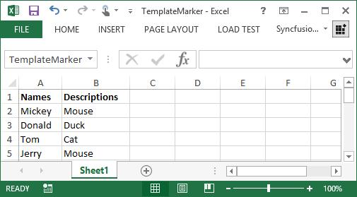

You can also add/insert template markers using XlsIO APIs as shown below.

  

using (ExcelEngine excelEngine = new ExcelEngine())
{
  IWorkbook workbook = excelEngine.Excel.Workbooks.Open("Sample.xlsx");
  IWorksheet sheet = workbook.Worksheets[0];

  //Insert Simple marker
  sheet.Range["B2"].Text = "%Marker";

  //Insert marker which gets value of Author name
  sheet.Range["C2"].Text = "%Marker2.Worksheet.Workbook.Author";

  //Insert marker which gets cell address
  sheet.Range["H2"].Text = "%ArrayProperty.Cells.Address";

  //Create Template Marker Processor
  ITemplateMarkersProcessor marker = workbook.CreateTemplateMarkersProcessor();
  
  //Add collections to the marker variables where the name should match with input template
  marker.AddVariable("Marker", "First test of markers");
  marker.AddVariable("Marker2", sheet.Range["B2"]);
  marker.AddVariable("ArrayProperty", sheet.Range["B2:G2"]);

  //Process the markers in the template
  marker.ApplyMarkers();

  workbook.Version = ExcelVersion.Excel2013;
  workbook.SaveAs("TemplateMarker.xlsx");
}   




Using excelEngine As ExcelEngine = New ExcelEngine()
  Dim workbook As IWorkbook = excelEngine.Excel.Workbooks.Open("Sample.xlsx")
  IWorksheet sheet = workbook.Worksheets(0)

  'Insert Simple marker
  sheet.Range("B2").Text = "%Marker"

  'Insert marker which gets value of Author name
  sheet.Range("C2").Text = "%Marker2.Worksheet.Workbook.Author"

  'Insert marker which gets cell address
  sheet.Range("H2").Text = "%ArrayProperty.Cells.Address"

  'Create Template Marker Processor
  Dim marker As ITemplateMarkersProcessor = workbook.CreateTemplateMarkersProcessor()
  
  'Add collections to the marker variables where the name should match with input template
  marker.AddVariable("Marker", "First test of markers")
  marker.AddVariable("Marker2", sheet.Range("B2"))
  marker.AddVariable("ArrayProperty", sheet.Range("B2:G2"))

  'Process the markers in the template
  marker.ApplyMarkers()

  workbook.Version = ExcelVersion.Excel2013
  workbook.SaveAs("TemplateMarker.xlsx")
End Using




using (ExcelEngine excelEngine = new ExcelEngine())
{
  //Gets assembly
  Assembly assembly = typeof(App).GetTypeInfo().Assembly;

  //Gets input Excel document from embedded resource collection
  Stream inputStream = assembly.GetManifestResourceStream("Sample.xlsx");

  IWorkbook workbook = await excelEngine.Excel.Workbooks.OpenAsync(inputStream);
  IWorksheet sheet = workbook.Worksheets[0];

  //Insert Simple marker
  sheet.Range["B2"].Text = "%Marker";

  //Insert marker which gets value of Author name
  sheet.Range["C2"].Text = "%Marker2.Worksheet.Workbook.Author";

  //Insert marker which gets cell address
  sheet.Range["H2"].Text = "%ArrayProperty.Cells.Address";

  //Create Template Marker Processor
  ITemplateMarkersProcessor marker = workbook.CreateTemplateMarkersProcessor();
  
  //Add collections to the marker variables where the name should match with input template
  marker.AddVariable("Marker", "First test of markers");
  marker.AddVariable("Marker2", sheet.Range["B2"]);
  marker.AddVariable("ArrayProperty", sheet.Range["B2:G2"]);

  //Process the markers in the template
  marker.ApplyMarkers();

  workbook.Version = ExcelVersion.Excel2013;

  //Initializes FileSavePicker
  FileSavePicker savePicker = new FileSavePicker();
  savePicker.SuggestedStartLocation = PickerLocationId.Desktop;
  savePicker.SuggestedFileName = "TemplateMarker";
  savePicker.FileTypeChoices.Add("Excel Files", new List<string>() { ".xlsx" });

  //Creates a storage file from FileSavePicker
  StorageFile storageFile = await savePicker.PickSaveFileAsync();

  //Saves changes to the specified storage file
  await workbook.SaveAsAsync(storageFile);
}




using (ExcelEngine excelEngine = new ExcelEngine())
{
  IApplication application = excelEngine.Excel;

  FileStream fileStream = new FileStream("Sample.xlsx", FileMode.Open, FileAccess.Read);

  IWorkbook workbook = application.Workbooks.Open(fileStream);
  IWorksheet sheet = workbook.Worksheets[0];

  //Insert Simple marker
  sheet.Range["B2"].Text = "%Marker";

  //Insert marker which gets value of Author name
  sheet.Range["C2"].Text = "%Marker2.Worksheet.Workbook.Author";

  //Insert marker which gets cell address
  sheet.Range["H2"].Text = "%ArrayProperty.Cells.Address";

  //Create Template Marker Processor
  ITemplateMarkersProcessor marker = workbook.CreateTemplateMarkersProcessor();
  
  //Add collections to the marker variables where the name should match with input template
  marker.AddVariable("Marker", "First test of markers");
  marker.AddVariable("Marker2", sheet.Range["B2"]);
  marker.AddVariable("ArrayProperty", sheet.Range["B2:G2"]);

  //Process the markers in the template
  marker.ApplyMarkers();

  //Saving the workbook as stream
  workbook.Version = ExcelVersion.Excel2013;
  FileStream stream = new FileStream("TemplateMarker.xlsx", FileMode.Create, FileAccess.ReadWrite);
  workbook.SaveAs(stream);
  stream.Dispose();
}




using(ExcelEngine excelEngine = new ExcelEngine())
{
  IApplication application = excelEngine.Excel;
  
  //Gets assembly
  Assembly assembly = typeof(App).GetTypeInfo().Assembly;
             
  //Gets input Excel document from embedded resource collection
  Stream inputStream = assembly.GetManifestResourceStream("Sample.xlsx");
  
  IWorkbook workbook = application.Workbooks.Open(inputStream);
  IWorksheet sheet = workbook.Worksheets[0];

  //Insert Simple marker
  sheet.Range["B2"].Text = "%Marker";

  //Insert marker which gets value of Author name
  sheet.Range["C2"].Text = "%Marker2.Worksheet.Workbook.Author";

  //Insert marker which gets cell address
  sheet.Range["H2"].Text = "%ArrayProperty.Cells.Address";

  //Create Template Marker Processor
  ITemplateMarkersProcessor marker = workbook.CreateTemplateMarkersProcessor();
  
  //Add collections to the marker variables where the name should match with input template
  marker.AddVariable("Marker", "First test of markers");
  marker.AddVariable("Marker2", sheet.Range["B2"]);
  marker.AddVariable("ArrayProperty", sheet.Range["B2:G2"]);

  //Process the markers in the template
  marker.ApplyMarkers();

  //Saving the workbook as stream
  workbook.Version = ExcelVersion.Excel2013;
  MemoryStream outputStream = new MemoryStream();
  workbook.SaveAs(outputStream);

  //Save the stream as Excel document and view the saved document  
  
  //The operation in SaveAndView under Xamarin varies between Windows Phone, Android and iOS platforms. Please refer xlsio/xamarin section for respective code samples.
  if (Device.OS == TargetPlatform.WinPhone || Device.OS == TargetPlatform.Windows)
      await DependencyService.Get<ISaveWindowsPhone>().SaveAndView("TemplateMarker.xlsx", "application/msexcel", outputStream);
  else
      DependencyService.Get<ISave>().SaveAndView("TemplateMarker.xlsx", "application/msexcel", outputStream);

  //Dispose the input and output stream instances
  inputStream.Dispose();
  outputStream.Dispose();
}


  

## Bind from DataTable

**Syntax****:**

<table>
<tr>
<td>
%&lt;DataSource&gt;.&lt;FieldName&gt;   For example: %Products.ProductName  Where, “Products” is a data source which can be data tables, datasets, data readers and data views and ProductName is the field name or column name  </td></tr>
</table>
By default, DataTable values will be filled in the worksheet as a string format. You can detect data type and number format of DataTable values by using VariableTypeAction enumerator. To know more about the VariableTypeAction enumerator, please refer **VariableTypeAction** in API section.

Here is the screen shot of input template which has a template marker.

The following code snippet illustrates how to detect data type and apply number format with template marker.

  

using(ExcelEngine excelEngine = new ExcelEngine())
{
  IWorkbook workbook = excelEngine.Excel.Workbooks.Open("TemplateMarker.xlsx");

  //Create Template Marker Processor
  ITemplateMarkersProcessor marker = workbook.CreateTemplateMarkersProcessor();

  DataTable reports = new DataTable();
  reports.Columns.Add("SalesPerson");
  reports.Columns.Add("FromDate", typeof(DateTime));
  reports.Columns.Add("ToDate", typeof(DateTime));
  reports.Rows.Add("Andy Bernard", new DateTime(2014, 09, 08), new DateTime(2014, 09, 11));
  reports.Rows.Add("Jim Halpert", new DateTime(2014, 09, 11), new DateTime(2014, 09, 15));
  reports.Rows.Add("Karen Fillippelli", new DateTime(2014, 09, 15), new DateTime(2014, 09, 20));
  reports.Rows.Add("Phyllis Lapin", new DateTime(2014, 09, 21), new DateTime(2014, 09, 25));
  reports.Rows.Add("Stanley Hudson", new DateTime(2014, 09, 26), new DateTime(2014, 09, 30));

  //Add collection to the marker variables where the name should match with input template
  //Detects number format in DateTable values
  marker.AddVariable("Reports", reports,VariableTypeAction.DetectNumberFormat);

  //Process the markers and detect the number format along with the data type in the template
  marker.ApplyMarkers();

  workbook.Version = ExcelVersion.Excel2013;
  workbook.SaveAs("TemplateMarkerWithFormat.xlsx");
}




using excelEngine As ExcelEngine = new ExcelEngine()
  Dim workbook As IWorkbook = excelEngine.Excel.Workbooks.Open("TemplateMarker.xlsx")

  'Create Template Marker Processor
  Dim marker As ITemplateMarkersProcessor = workbook.CreateTemplateMarkersProcessor()

  Dim reports As New DataTable()
  reports.Columns.Add("SalesPerson")
  reports.Columns.Add("FromDate", GetType(DateTime))
  reports.Columns.Add("ToDate", GetType(DateTime))
  reports.Rows.Add("Andy Bernard", New DateTime(2014, 9, 8), New DateTime(2014, 9, 11))
  reports.Rows.Add("Jim Halpert", New DateTime(2014, 9, 11), New DateTime(2014, 9, 15))
  reports.Rows.Add("Karen Fillippelli", New DateTime(2014, 9, 15), New DateTime(2014, 9, 20))
  reports.Rows.Add("Phyllis Lapin", New DateTime(2014, 9, 21), New DateTime(2014, 9, 25))
  reports.Rows.Add("Stanley Hudson", New DateTime(2014, 9, 26), New DateTime(2014, 9, 30))

  'Add collection to the marker variables where the name should match with input template
  'Detects number format in DateTable values
  marker.AddVariable("Reports", reports, VariableTypeAction.DetectNumberFormat)

  'Process the markers and detect the number format along with the data type in the template
  marker.ApplyMarkers()

  workbook.Version = ExcelVersion.Excel2013
  workbook.SaveAs("TemplateMarkerWithFormat.xlsx")
End Using




//XlsIO supports binding data from data table using template markers in Windows Forms, WPF, ASP.NET, ASP.NET MVC and ASP.NET Core (2.0 onwards) platforms alone.



//Binding data from data table is supported only from ASP.NET Core 2.0
using (ExcelEngine excelEngine = new ExcelEngine())
{
  IApplication application = excelEngine.Excel;
  FileStream fileStream = new FileStream("TemplateMarker.xlsx", FileMode.Open, FileAccess.Read);
  IWorkbook workbook = application.Workbooks.Open(fileStream);

  //Create Template Marker Processor
  ITemplateMarkersProcessor marker = workbook.CreateTemplateMarkersProcessor();

  DataTable reports = new DataTable();
  reports.Columns.Add("SalesPerson");
  reports.Columns.Add("FromDate", typeof(DateTime));
  reports.Columns.Add("ToDate", typeof(DateTime));
  reports.Rows.Add("Andy Bernard", new DateTime(2014, 09, 08), new DateTime(2014, 09, 11));
  reports.Rows.Add("Jim Halpert", new DateTime(2014, 09, 11), new DateTime(2014, 09, 15));
  reports.Rows.Add("Karen Fillippelli", new DateTime(2014, 09, 15), new DateTime(2014, 09, 20));
  reports.Rows.Add("Phyllis Lapin", new DateTime(2014, 09, 21), new DateTime(2014, 09, 25));
  reports.Rows.Add("Stanley Hudson", new DateTime(2014, 09, 26), new DateTime(2014, 09, 30));
  
  //Add collection to the marker variables where the name should match with input template  
  //Detects number format in DateTable values
  marker.AddVariable("Reports", reports, VariableTypeAction.DetectNumberFormat);

  //Process the markers and detect the number format along with the data type in the template
  marker.ApplyMarkers();

  //Saving the workbook as stream
  workbook.Version = ExcelVersion.Excel2013;

  FileStream stream = new FileStream("TemplateMarkerWithFormat.xlsx", FileMode.Create, FileAccess.ReadWrite);
  workbook.SaveAs(stream);
  stream.Dispose();
}




//XlsIO supports binding data from data table using template markers in Windows Forms, WPF, ASP.NET, ASP.NET MVC and ASP.NET Core (2.0 onwards) platforms alone.

  

Here is the screen shot of generated excel in which data type is detected and then number format is applied.   

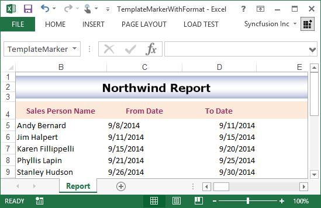

## Bind from Business objects with images

You can generate reports more appealingly with image support in Template Markers. The possible images supported are listed below.

* GIF
* JPEG
* PNG
* BMP
* TIFF

XlsIO detects the property as image when its type is System.Drawing.Image or byte [].The image can be formatted using following arguments 

<table>
<tr>
<th>
No  </th><th>
Image arguments  </th><th>
Description  </th></tr>
<tr>
<td>
1  </td><td>
No argument Ex: %Reports.Image;  </td><td>
Image is applied with a default size (50x50 pixels) and position (Top-Left).  </td></tr>
<tr>
<td>
2  </td><td>
fittocell Ex: %Reports.Image;fittocell  </td><td>
The image is applied to cell width and height.  </td></tr>
<tr>
<td>
3  </td><td>
size:width,height  Ex:  %Reports.Image;size:60  (or)  %Reports.Image;size:60,60  </td><td>
Image is applied to the specified size (width, height).  Height parameter is optional. Value of width is applied when height is not specified.  </td></tr>
<tr>
<td>
4  </td><td>
position:position  Ex:  %Reports.Image;position:middle-center  (or)  %Reports.Image;position:right   </td><td>
Image is positioned (top-left, top-center, etc.,) within the cell.  </td></tr>
</table>
In the following example, a marker is added for merging images.  Like a simple template marker, data source and property name is specified (%Reports.Image;) for image also. 

__Marker__ __added__ __for__ __merging__ __images__

N> Image can be used in array, DataTable and Business objects.

Different positions of image are maintained internally in ImageVerticalPosition and ImageHorizontalPosition enumerators.  To know more about this, please refer **ImageVerticalPosition** and **ImageHorizontalPosition** enumerators respectively in API section.

The output screens of all the image insertion options along with its input templates are as follows.

**Default** **image** **input** **and** **output**

Input Template

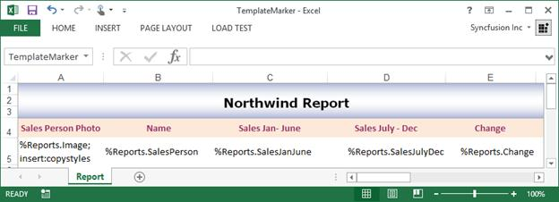

Generated Output

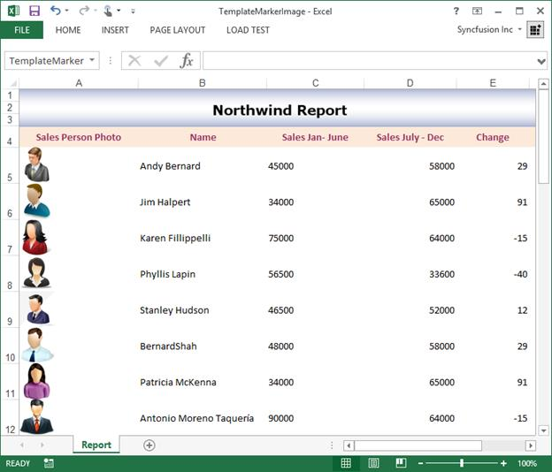

**Image** **with** **FitToCell** **attribute**

Input Template

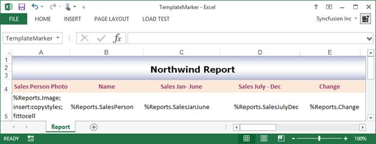

Generated Output

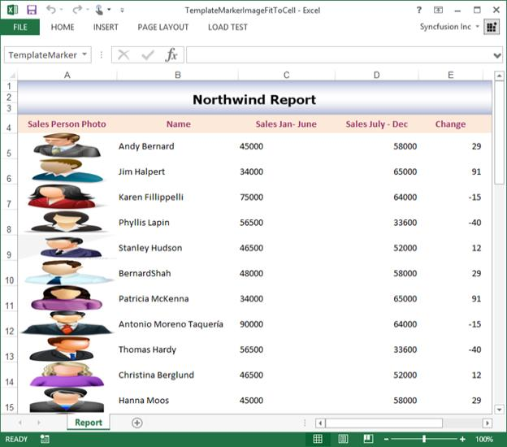

**Image** **with** **Size**

Input Template

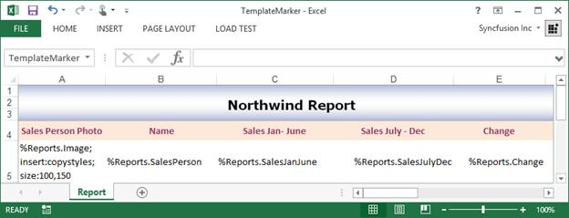

Generated Output

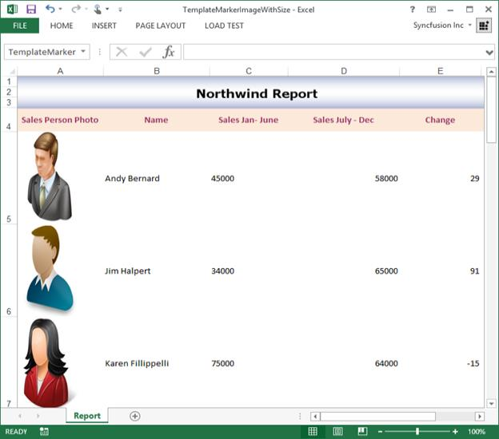

**Image** **with** **Position**

Input Template

Generated Output

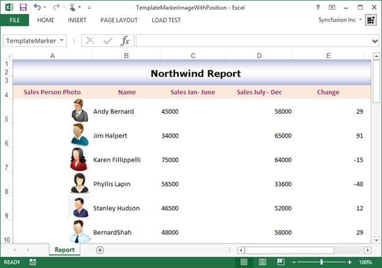

**Image** **with** **position** **and** **size**

Input Template

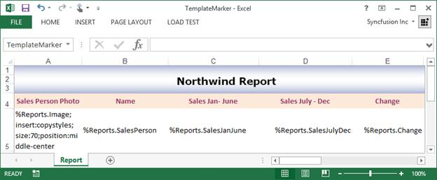

Generated Output

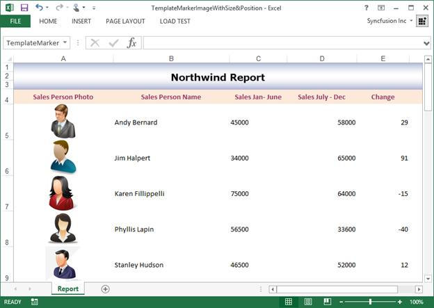

You can also refer [Template based data filling using Template Markers](/file-formats/xlsio/getting-started#template-based-data-filling-using-template-markers) section in [Getting Started](/file-formats/xlsio/getting-started) for the sample regarding template marker with images.

## Template Marker with Conditional Formatting

You can create or apply conditional format to the template marker range.  

Here is the screen shot of input template which has a template marker.

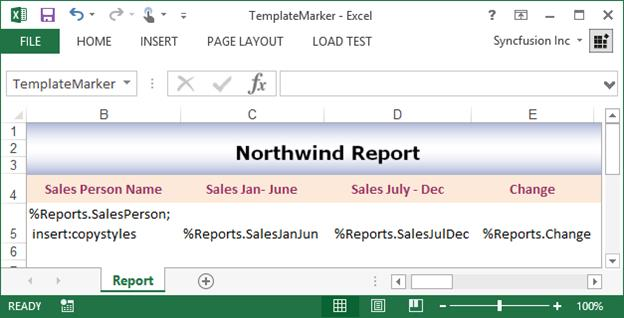

The following code sample illustrates how to create or apply conditional format to the marker.

  

using (ExcelEngine excelEngine = new ExcelEngine())
{
  #region Initialize Workbook

  IWorkbook workbook = excelEngine.Excel.Workbooks.Open("TemplateMarker.xlsx");
  IWorksheet worksheet = workbook.Worksheets[0];

  #endregion

  #region Create Template Marker

  //Create Template Marker Processor
  ITemplateMarkersProcessor marker = workbook.CreateTemplateMarkersProcessor();

  IConditionalFormats conditionalFormats = marker.CreateConditionalFormats(worksheet["C5"]);

  #region Data Bar

  //Apply markers using Formula
  IConditionalFormat condition = conditionalFormats.AddCondition();

  //Set Data bar and icon set for the same cell
  //Set the format type
  condition.FormatType = ExcelCFType.DataBar;

  IDataBar dataBar = condition.DataBar;

  //Set the constraint
  dataBar.MinPoint.Type = ConditionValueType.LowestValue;
  dataBar.MinPoint.Value = "0";
  dataBar.MaxPoint.Type = ConditionValueType.HighestValue;
  dataBar.MaxPoint.Value = "0";

  //Set color for Bar
  dataBar.BarColor = Color.FromArgb(156, 208, 243);

  //Hide the value in data bar
  dataBar.ShowValue = false;

  #endregion

  #region IconSet

  condition = conditionalFormats.AddCondition();
  condition.FormatType = ExcelCFType.IconSet;

  IIconSet iconSet = condition.IconSet;
  iconSet.IconSet = ExcelIconSetType.FourRating;
  iconSet.IconCriteria[0].Type = ConditionValueType.LowestValue;
  iconSet.IconCriteria[0].Value = "0";
  iconSet.IconCriteria[1].Type = ConditionValueType.HighestValue;
  iconSet.IconCriteria[1].Value = "0";
  iconSet.ShowIconOnly = true;

  #endregion

  conditionalFormats = marker.CreateConditionalFormats(worksheet["D5"]);

  #region Color Scale

  condition = conditionalFormats.AddCondition();
  condition.FormatType = ExcelCFType.ColorScale;

  IColorScale colorScale = condition.ColorScale;

  //Sets 3 - color scale
  colorScale.SetConditionCount(3);

  colorScale.Criteria[0].FormatColorRGB = Color.FromArgb(230, 197, 218);
  colorScale.Criteria[0].Type = ConditionValueType.LowestValue;
  colorScale.Criteria[0].Value = "0";

  colorScale.Criteria[1].FormatColorRGB = Color.FromArgb(244, 210, 178);
  colorScale.Criteria[1].Type = ConditionValueType.Percentile;
  colorScale.Criteria[1].Value = "50";

  colorScale.Criteria[2].FormatColorRGB = Color.FromArgb(245, 247, 171);
  colorScale.Criteria[2].Type = ConditionValueType.HighestValue;
  colorScale.Criteria[2].Value = "0";

  #endregion

  conditionalFormats = marker.CreateConditionalFormats(worksheet["E5"]);

  #region IconSet

  condition = conditionalFormats.AddCondition();
  condition.FormatType = ExcelCFType.IconSet;

  iconSet = condition.IconSet;
  iconSet.IconSet = ExcelIconSetType.ThreeSymbols;

  iconSet.IconCriteria[0].Type = ConditionValueType.LowestValue;
  iconSet.IconCriteria[0].Value = "0";

  iconSet.IconCriteria[1].Type = ConditionValueType.HighestValue;
  iconSet.IconCriteria[1].Value = "0";

  iconSet.ShowIconOnly = false;

  #endregion

  //Add collection to the marker variables where the name should match with input template
  marker.AddVariable("Reports", GetSalesReports());

  //Process the markers in the template
  marker.ApplyMarkers();

  #endregion

  #region Save the Workbook

  workbook.Version = ExcelVersion.Excel2013;
  workbook.SaveAs("TemplateMarkerCF.xlsx");

  #endregion
}




'Region "Initialize Workbook"

using excelEngine As ExcelEngine = new ExcelEngine()
  Dim workbook As IWorkbook = excelEngine.Excel.Workbooks.Open("TemplateMarker.xlsx")
  Dim worksheet As IWorksheet = workbook.Worksheets(0)

  'End Region

  'Region "Create Template Marker"

  'Create Template Marker Processor
  Dim marker As ITemplateMarkersProcessor = workbook.CreateTemplateMarkersProcessor()

  Dim conditionalFormats As IConditionalFormats = marker.CreateConditionalFormats(worksheet("C5"))

  'Region "Data Bar"

  'Apply markers using Formula
  Dim condition As IConditionalFormat = conditionalFormats.AddCondition()

  'Set Data bar and icon set for the same cell
  'Set the format type
  condition.FormatType = ExcelCFType.DataBar

  Dim dataBar As IDataBar = condition.DataBar

  'Set the constraint
  dataBar.MinPoint.Type = ConditionValueType.LowestValue
  dataBar.MinPoint.Value = "0"
  dataBar.MaxPoint.Type = ConditionValueType.HighestValue
  dataBar.MaxPoint.Value = "0"

  'Set color for Bar
  dataBar.BarColor = Color.FromArgb(156, 208, 243)

  'Hide the value in data bar
  dataBar.ShowValue = False

  'End Region

  'Region "IconSet"

  condition = conditionalFormats.AddCondition()
  condition.FormatType = ExcelCFType.IconSet

  Dim iconSet As IIconSet = condition.IconSet
  iconSet.IconSet = ExcelIconSetType.FourRating

  iconSet.IconCriteria(0).Type = ConditionValueType.LowestValue
  iconSet.IconCriteria(0).Value = "0"

  iconSet.IconCriteria(1).Type = ConditionValueType.HighestValue
  iconSet.IconCriteria(1).Value = "0"

  iconSet.ShowIconOnly = True

  'End Region

  conditionalFormats = marker.CreateConditionalFormats(worksheet("D5"))

  'Region "Color Scale"

  condition = conditionalFormats.AddCondition()
  condition.FormatType = ExcelCFType.ColorScale

  Dim colorScale As IColorScale = condition.ColorScale

  'Sets 3 - color scale
  colorScale.SetConditionCount(3)

  colorScale.Criteria(0).FormatColorRGB = Color.FromArgb(230, 197, 218)
  colorScale.Criteria(0).Type = ConditionValueType.LowestValue
  colorScale.Criteria(0).Value = "0"

  colorScale.Criteria(1).FormatColorRGB = Color.FromArgb(244, 210, 178)
  colorScale.Criteria(1).Type = ConditionValueType.Percentile
  colorScale.Criteria(1).Value = "50"

  colorScale.Criteria(2).FormatColorRGB = Color.FromArgb(245, 247, 171)
  colorScale.Criteria(2).Type = ConditionValueType.HighestValue
  colorScale.Criteria(2).Value = "0"

  'End Region

  conditionalFormats = marker.CreateConditionalFormats(worksheet("E5"))

  'Region "IconSet"

  condition = conditionalFormats.AddCondition()
  condition.FormatType = ExcelCFType.IconSet

  iconSet = condition.IconSet
  iconSet.IconSet = ExcelIconSetType.ThreeSymbols

  iconSet.IconCriteria(0).Type = ConditionValueType.LowestValue
  iconSet.IconCriteria(0).Value = "0"

  iconSet.IconCriteria(1).Type = ConditionValueType.HighestValue
  iconSet.IconCriteria(1).Value = "0"

  iconSet.ShowIconOnly = False

  'End Region

  'Add collection to the marker variables where the name should match with input template
  marker.AddVariable("Reports", GetSalesReports())

  'Process the markers in the template
  marker.ApplyMarkers()

  'End Region

  'Region "Save the Workbook"

  workbook.Version = ExcelVersion.Excel2013
  workbook.SaveAs("TemplateMarkerCF.xlsx")

  'End Region
End Using



using (ExcelEngine excelEngine = new ExcelEngine())
{
  //Gets assembly
  Assembly assembly = typeof(App).GetTypeInfo().Assembly;

  //Gets input Excel document from embedded resource collection
  Stream inputStream = assembly.GetManifestResourceStream("TemplateMarker.TemplateMarker.xlsx");

  IWorkbook workbook = await excelEngine.Excel.Workbooks.OpenAsync(inputStream);
  IWorksheet worksheet = workbook.Worksheets[0];

  #endregion

  #region Create Template Marker

  //Create Template Marker Processor
  ITemplateMarkersProcessor marker = workbook.CreateTemplateMarkersProcessor();

  IConditionalFormats conditionalFormats = marker.CreateConditionalFormats(worksheet["C5"]);

  #region Data Bar

  //Apply markers using Formula
  IConditionalFormat condition = conditionalFormats.AddCondition();

  //Set Data bar and icon set for the same cell
  //Set the format type
  condition.FormatType = ExcelCFType.DataBar;

  IDataBar dataBar = condition.DataBar;

  //Set the constraint
  dataBar.MinPoint.Type = ConditionValueType.LowestValue;
  dataBar.MinPoint.Value = "0";
  dataBar.MaxPoint.Type = ConditionValueType.HighestValue;
  dataBar.MaxPoint.Value = "0";

  //Set color for Bar
  dataBar.BarColor = Color.FromArgb(156, 208, 243, 255);

  //Hide the value in data bar
  dataBar.ShowValue = false;

  #endregion

  #region IconSet

  condition = conditionalFormats.AddCondition();
  condition.FormatType = ExcelCFType.IconSet;

  IIconSet iconSet = condition.IconSet;
  iconSet.IconSet = ExcelIconSetType.FourRating;
  iconSet.IconCriteria[0].Type = ConditionValueType.LowestValue;
  iconSet.IconCriteria[0].Value = "0";
  iconSet.IconCriteria[1].Type = ConditionValueType.HighestValue;
  iconSet.IconCriteria[1].Value = "0";
  iconSet.ShowIconOnly = true;

  #endregion

  conditionalFormats = marker.CreateConditionalFormats(worksheet["D5"]);

  #region Color Scale

  condition = conditionalFormats.AddCondition();
  condition.FormatType = ExcelCFType.ColorScale;

  IColorScale colorScale = condition.ColorScale;

  //Sets 3 - color scale
  colorScale.SetConditionCount(3);

  colorScale.Criteria[0].FormatColorRGB = Color.FromArgb(230, 197, 218, 255);
  colorScale.Criteria[0].Type = ConditionValueType.LowestValue;
  colorScale.Criteria[0].Value = "0";

  colorScale.Criteria[1].FormatColorRGB = Color.FromArgb(244, 210, 178, 255);
  colorScale.Criteria[1].Type = ConditionValueType.Percentile;
  colorScale.Criteria[1].Value = "50";

  colorScale.Criteria[2].FormatColorRGB = Color.FromArgb(245, 247, 171, 255);
  colorScale.Criteria[2].Type = ConditionValueType.HighestValue;
  colorScale.Criteria[2].Value = "0";

  #endregion

  conditionalFormats = marker.CreateConditionalFormats(worksheet["E5"]);

  #region IconSet

  condition = conditionalFormats.AddCondition();
  condition.FormatType = ExcelCFType.IconSet;

  iconSet = condition.IconSet;
  iconSet.IconSet = ExcelIconSetType.ThreeSymbols;

  iconSet.IconCriteria[0].Type = ConditionValueType.LowestValue;
  iconSet.IconCriteria[0].Value = "0";

  iconSet.IconCriteria[1].Type = ConditionValueType.HighestValue;
  iconSet.IconCriteria[1].Value = "0";

  iconSet.ShowIconOnly = false;

  #endregion

  //Add collection to the marker variables where the name should match with input template
  marker.AddVariable("Reports", GetSalesReports());

  //Process the markers in the template
  marker.ApplyMarkers();

  #endregion

  #region Save the Workbook

  workbook.Version = ExcelVersion.Excel2013;

  //Initializes FileSavePicker
  FileSavePicker savePicker = new FileSavePicker();
  savePicker.SuggestedStartLocation = PickerLocationId.Desktop;
  savePicker.SuggestedFileName = "TemplateMarkerCF";
  savePicker.FileTypeChoices.Add("Excel Files", new List<string>() { ".xlsx" });

  //Creates a storage file from FileSavePicker
  StorageFile storageFile = await savePicker.PickSaveFileAsync();

  //Saves changes to the specified storage file
  await workbook.SaveAsAsync(storageFile);

  #endregion
}




using (ExcelEngine excelEngine = new ExcelEngine())
{
  #region Initialize Workbook

  FileStream fileStream = new FileStream("TemplateMarker.xlsx", FileMode.Open, FileAccess.Read);

  IWorkbook workbook = excelEngine.Excel.Workbooks.Open(fileStream);
  IWorksheet worksheet = workbook.Worksheets[0];

  #endregion

  #region Create Template Marker

  //Create Template Marker Processor
  ITemplateMarkersProcessor marker = workbook.CreateTemplateMarkersProcessor();

  IConditionalFormats conditionalFormats = marker.CreateConditionalFormats(worksheet["C5"]);

  #endregion

  #region Data Bar

  //Apply markers using Formula
  IConditionalFormat condition = conditionalFormats.AddCondition();

  //Set Data bar and icon set for the same cell
  //Set the format type
  condition.FormatType = ExcelCFType.DataBar;

  IDataBar dataBar = condition.DataBar;

  //Set the constraint
  dataBar.MinPoint.Type = ConditionValueType.LowestValue;
  dataBar.MinPoint.Value = "0";
  dataBar.MaxPoint.Type = ConditionValueType.HighestValue;
  dataBar.MaxPoint.Value = "0";

  //Set color for Bar
  dataBar.BarColor = Color.FromArgb(156, 208, 243);

  //Hide the value in data bar
  dataBar.ShowValue = false;

  #endregion

  #region IconSet

  condition = conditionalFormats.AddCondition();
  condition.FormatType = ExcelCFType.IconSet;

  IIconSet iconSet = condition.IconSet;
  iconSet.IconSet = ExcelIconSetType.FourRating;

  iconSet.IconCriteria[0].Type = ConditionValueType.LowestValue;
  iconSet.IconCriteria[0].Value = "0";

  iconSet.IconCriteria[1].Type = ConditionValueType.HighestValue;
  iconSet.IconCriteria[1].Value = "0";

  iconSet.ShowIconOnly = true;

  #endregion

  conditionalFormats = marker.CreateConditionalFormats(worksheet["D5"]);

  #region Color Scale

  condition = conditionalFormats.AddCondition();
  condition.FormatType = ExcelCFType.ColorScale;

  IColorScale colorScale = condition.ColorScale;

  //Sets 3 - color scale
  colorScale.SetConditionCount(3);

  colorScale.Criteria[0].FormatColorRGB = Color.FromArgb(230, 197, 218);
  colorScale.Criteria[0].Type = ConditionValueType.LowestValue;
  colorScale.Criteria[0].Value = "0";

  colorScale.Criteria[1].FormatColorRGB = Color.FromArgb(244, 210, 178);
  colorScale.Criteria[1].Type = ConditionValueType.Percentile;
  colorScale.Criteria[1].Value = "50";

  colorScale.Criteria[2].FormatColorRGB = Color.FromArgb(245, 247, 171);
  colorScale.Criteria[2].Type = ConditionValueType.HighestValue;
  colorScale.Criteria[2].Value = "0";

  #endregion

  conditionalFormats = marker.CreateConditionalFormats(worksheet["E5"]);

  #region IconSet

  condition = conditionalFormats.AddCondition();
  condition.FormatType = ExcelCFType.IconSet;

  iconSet = condition.IconSet;
  iconSet.IconSet = ExcelIconSetType.ThreeSymbols;

  iconSet.IconCriteria[0].Type = ConditionValueType.LowestValue;
  iconSet.IconCriteria[0].Value = "0";

  iconSet.IconCriteria[1].Type = ConditionValueType.HighestValue;
  iconSet.IconCriteria[1].Value = "0";

  iconSet.ShowIconOnly = false;

  #endregion

  //Add collection to the marker variables where the name should match with input template
  marker.AddVariable("Reports", GetSalesReports());

  //Process the markers in the template
  marker.ApplyMarkers();

  //Saving the workbook as stream
  workbook.Version = ExcelVersion.Excel2013;
  FileStream stream = new FileStream("TemplateMarkerCF.xlsx", FileMode.Create, FileAccess.ReadWrite);
  workbook.SaveAs(stream);
  stream.Dispose();
}




using (ExcelEngine excelEngine = new ExcelEngine())
{
  #region Initialize Workbook

  //Gets assembly
  Assembly assembly = typeof(App).GetTypeInfo().Assembly;

  //Gets input Excel document from embedded resource collection
  Stream inputStream = assembly.GetManifestResourceStream("TemplateMarker.xlsx");

  IWorkbook workbook = excelEngine.Excel.Workbooks.Open(inputStream);
  IWorksheet worksheet = workbook.Worksheets[0];

  #endregion

  #region Create Template Marker

  //Create Template Marker Processor
  ITemplateMarkersProcessor marker = workbook.CreateTemplateMarkersProcessor();

  IConditionalFormats conditionalFormats = marker.CreateConditionalFormats(worksheet["C5"]);

  #endregion

  #region Data Bar

  //Apply markers using Formula
  IConditionalFormat condition = conditionalFormats.AddCondition();

  //Set Data bar and icon set for the same cell
  //Set the format type
  condition.FormatType = ExcelCFType.DataBar;

  IDataBar dataBar = condition.DataBar;

  //Set the constraint
  dataBar.MinPoint.Type = ConditionValueType.LowestValue;
  dataBar.MinPoint.Value = "0";
  dataBar.MaxPoint.Type = ConditionValueType.HighestValue;
  dataBar.MaxPoint.Value = "0";

  //Hide the value in data bar
  dataBar.ShowValue = false;

  #endregion

  #region IconSet

  condition = conditionalFormats.AddCondition();
  condition.FormatType = ExcelCFType.IconSet;

  IIconSet iconSet = condition.IconSet;
  iconSet.IconSet = ExcelIconSetType.FourRating;

  iconSet.IconCriteria[0].Type = ConditionValueType.LowestValue;
  iconSet.IconCriteria[0].Value = "0";

  iconSet.IconCriteria[1].Type = ConditionValueType.HighestValue;
  iconSet.IconCriteria[1].Value = "0";

  iconSet.ShowIconOnly = true;

  #endregion

  conditionalFormats = marker.CreateConditionalFormats(worksheet["D5"]);

  #region Color Scale

  condition = conditionalFormats.AddCondition();
  condition.FormatType = ExcelCFType.ColorScale;

  IColorScale colorScale = condition.ColorScale;

  //Sets 3 - color scale
  colorScale.SetConditionCount(3);

  colorScale.Criteria[0].FormatColorRGB = Syncfusion.Drawing.Color.FromArgb(230, 197, 218);
  colorScale.Criteria[0].Type = ConditionValueType.LowestValue;
  colorScale.Criteria[0].Value = "0";

  colorScale.Criteria[1].FormatColorRGB = Syncfusion.Drawing.Color.FromArgb(244, 210, 178);
  colorScale.Criteria[1].Type = ConditionValueType.Percentile;
  colorScale.Criteria[1].Value = "50";

  colorScale.Criteria[2].FormatColorRGB = Syncfusion.Drawing.Color.FromArgb(245, 247, 171);
  colorScale.Criteria[2].Type = ConditionValueType.HighestValue;
  colorScale.Criteria[2].Value = "0";

  #endregion

  conditionalFormats = marker.CreateConditionalFormats(worksheet["E5"]);

  #region IconSet

  condition = conditionalFormats.AddCondition();
  condition.FormatType = ExcelCFType.IconSet;

  iconSet = condition.IconSet;
  iconSet.IconSet = ExcelIconSetType.ThreeSymbols;

  iconSet.IconCriteria[0].Type = ConditionValueType.LowestValue;
  iconSet.IconCriteria[0].Value = "0";

  iconSet.IconCriteria[1].Type = ConditionValueType.HighestValue;
  iconSet.IconCriteria[1].Value = "0";

  iconSet.ShowIconOnly = false;

  #endregion

  //Add collection to the marker variables where the name should match with input template
  marker.AddVariable("Reports", GetSalesReports());

  //Process the markers in the template
  marker.ApplyMarkers();

  //Saving the workbook as stream
  workbook.Version = ExcelVersion.Excel2013;
  MemoryStream outputStream = new MemoryStream();
  workbook.SaveAs(outputStream);

  //Save the stream as Excel document and view the saved document
  
  //The operation in SaveAndView under Xamarin varies between Windows Phone, Android and iOS platforms. Please refer xlsio/xamarin section for respective code samples.
  if (Device.OS == TargetPlatform.WinPhone || Device.OS == TargetPlatform.Windows)
      await DependencyService.Get<ISaveWindowsPhone>().SaveAndView("TemplateMarker.xlsx", "application/msexcel", outputStream);
  else
      DependencyService.Get<ISave>().SaveAndView("TemplateMarker.xlsx", "application/msexcel", outputStream);

  //Dispose the input and output stream instances
  inputStream.Dispose();
  outputStream.Dispose();
}

  

The following code snippet provides supporting methods & class for the above code.

**GetSalesReports** **Method****:**


public IList<Sales> GetSalesReports()
{
    IList<Sales> sales = new List<Sales>();

    sales.Add(new Sales("Andy Bernard", 45000, 58000, 29));

    sales.Add(new Sales("Jim Halpert", 34000, 65000, 91));

    sales.Add(new Sales("Karen Fillippelli", 75000, 64000, -15));

    sales.Add(new Sales("Phyllis Lapin", 56500, 33600, -40));

    sales.Add(new Sales("Stanley Hudson", 46500, 52000, 12));

    return sales;
}
public class Sales
{
    public string SalesPerson { get; set; }
    public int SalesJanJun { get; set; }
    public int SalesJulDec { get; set; }
    public int Change { get; set; }

    public Sales(string name, int salesJanJun, int salesJulDec, int change)
    {
        SalesPerson = name;
        SalesJanJun = salesJanJun;
        SalesJulDec = salesJulDec;
        Change = change;
    }
}


 Public Function GetSalesReports() As IList(Of Sales)
  Dim sales As IList(Of Sales) = New List(Of Sales)()
  sales.Add(New Sales("Andy Bernard", 45000, 58000, 29))
  sales.Add(New Sales("Jim Halpert", 34000, 65000, 91))
  sales.Add(New Sales("Karen Fillippelli", 75000, 64000, -15))
  sales.Add(New Sales("Phyllis Lapin", 56500, 33600, -40))
  sales.Add(New Sales("Stanley Hudson", 46500, 52000, 12))
  Return sales
End Function
Public Class Sales
  Public Property SalesPerson As String
  Public Property SalesJanJun As Integer
  Public Property SalesJulDec As Integer
  Public Property Change As Integer

  Public Sub New(ByVal name As String, ByVal salesJanJun As Integer, ByVal salesJulDec As Integer, ByVal change As Integer)
    SalesPerson = name
    salesJanJun = salesJanJun
    salesJulDec = salesJulDec
    change = change
  End Sub
End Class



public IList<Sales> GetSalesReports()
{
    IList<Sales> sales = new List<Sales>();

    sales.Add(new Sales("Andy Bernard", 45000, 58000, 29));

    sales.Add(new Sales("Jim Halpert", 34000, 65000, 91));

    sales.Add(new Sales("Karen Fillippelli", 75000, 64000, -15));

    sales.Add(new Sales("Phyllis Lapin", 56500, 33600, -40));

    sales.Add(new Sales("Stanley Hudson", 46500, 52000, 12));

    return sales;
}
public class Sales
{
    public string SalesPerson { get; set; }
    public int SalesJanJun { get; set; }
    public int SalesJulDec { get; set; }
    public int Change { get; set; }

    public Sales(string name, int salesJanJun, int salesJulDec, int change)
    {
        SalesPerson = name;
        SalesJanJun = salesJanJun;
        SalesJulDec = salesJulDec;
        Change = change;
    }
}


public IList<Sales> GetSalesReports()
{
    IList<Sales> sales = new List<Sales>();

    sales.Add(new Sales("Andy Bernard", 45000, 58000, 29));

    sales.Add(new Sales("Jim Halpert", 34000, 65000, 91));

    sales.Add(new Sales("Karen Fillippelli", 75000, 64000, -15));

    sales.Add(new Sales("Phyllis Lapin", 56500, 33600, -40));

    sales.Add(new Sales("Stanley Hudson", 46500, 52000, 12));

    return sales;
}
public class Sales
{
    public string SalesPerson { get; set; }
    public int SalesJanJun { get; set; }
    public int SalesJulDec { get; set; }
    public int Change { get; set; }

    public Sales(string name, int salesJanJun, int salesJulDec, int change)
    {
        SalesPerson = name;
        SalesJanJun = salesJanJun;
        SalesJulDec = salesJulDec;
        Change = change;
    }
}


public IList<Sales> GetSalesReports()
{
    IList<Sales> sales = new List<Sales>();

    sales.Add(new Sales("Andy Bernard", 45000, 58000, 29));

    sales.Add(new Sales("Jim Halpert", 34000, 65000, 91));

    sales.Add(new Sales("Karen Fillippelli", 75000, 64000, -15));

    sales.Add(new Sales("Phyllis Lapin", 56500, 33600, -40));

    sales.Add(new Sales("Stanley Hudson", 46500, 52000, 12));

    return sales;
}
public class Sales
{
    public string SalesPerson { get; set; }
    public int SalesJanJun { get; set; }
    public int SalesJulDec { get; set; }
    public int Change { get; set; }

    public Sales(string name, int salesJanJun, int salesJulDec, int change)
    {
        SalesPerson = name;
        SalesJanJun = salesJanJun;
        SalesJulDec = salesJulDec;
        Change = change;
    }
}



Here is the screen shot of generated excel in which conditional format is applied.

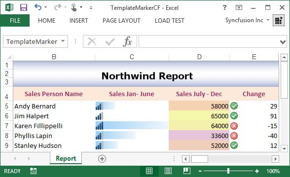

