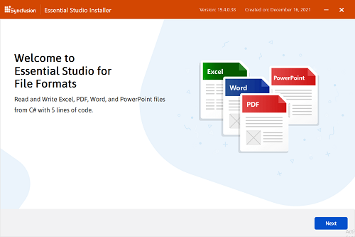
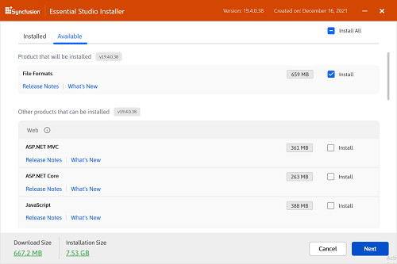
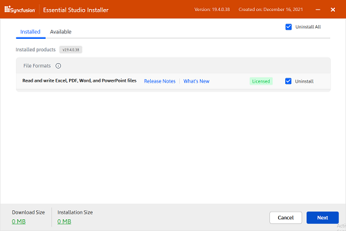
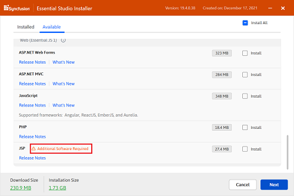
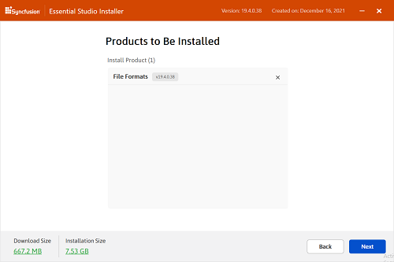
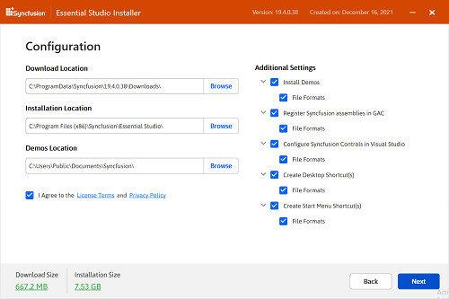

# Installation using Web Installer

The following procedure illustrates how to install Essential Studio for File Formats Online Installer. 

1.  Double-click the Syncfusion File Formats Online Installer setup file. The Setup Wizard opens and extracts the package automatically.

    

    
    N> The Setup wizard extracts the syncfusionfileformatswebinstaller_{version}.exe dialog, displaying the unzip operation of the package.
    
2. Welcome wizard of the Syncfusion Online Installer will be displayed. Click Proceed.

   

  
3.  Platform Selection wizard will be displayed. Here you can select the required platforms to be installed. Click Next.

    
	
	I> If the required software of the selected platform was not already installed, **Additional Software Required** alert will be displayed. However, you can continue the installation and install the required software later.
	
	
	
	N> You can check the Estimated size of the Download and Installation by clicking the **Download Size and Installation Size** link.
	
	

4.  Configuration wizard will be displayed. Here you can change the Install and samples location. Also, you can change the Additional settings by platform basis. To install using the default configuration, click Next.

    
	
 
    N> From the 2018 Volume 2 release, Syncfusion has changed the install and samples location 
	   **Default Install location:** {ProgramFilesFolder}\Syncfusion\{Platform}\{version}
	   **Default Samples location:** C:\Users\Public\Documents\Syncfusion\{platform}\{version}
	   However, you can change the locations by clicking browse button.

	

    * Select the **Install Demos** check box to install Syncfusion samples, or leave the check box clear, when you do not want to install Syncfusion samples.
    * Select the **Register Syncfusion Assemblies in GAC** check box to install the latest Syncfusion assemblies in GAC, or clear this check box when you do not want to install the latest assemblies in GAC.
    * Select the **Configure Syncfusion controls in Visual Studio** check box to configure the Syncfusion controls in the Visual Studio toolbox, or clear this check box when you do not want to configure the Syncfusion controls in the Visual Studio toolbox during setup installation. Note that you must also select the Register Syncfusion assemblies in GAC check box when you select this check box.
    * Select the **Configure Extensions controls in Visual Studio** checkbox to configure the Syncfusion Extensions in Visual Studio or clear this check box when you do not want to configure the Syncfusion Extensions in Visual Studio.

5.  After reading the License Terms and Conditions, check the **I agree to the License Terms and Privacy Policy** check box. Click Next.

6. Login wizard will be displayed. You should enter your Syncfusion Direct-Trac login credentials. If you don't have Syncfusion Direct-Trac login credentials, then you can click on **Create an Account**. Else if you forgot your password, click on **Forgot Password** to create new password. Click Install. 

    
	
	I> The selected platforms will be installed based on your Syncfusion License (Trial or Licensed).

7. Download and Installation progress will be displayed.

    

8. Once the Installation is complete, **Installation Summary** wizard will be displayed. Here you can check the list of platforms which are installed successfully and failed. Click Finish to exit the Installation Summary wizard. 

    
	
	* Click **Launch Control Panel** to open the Syncfusion Control Panel.

