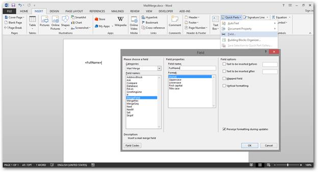
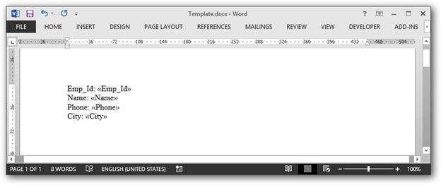
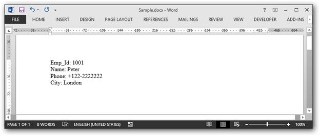
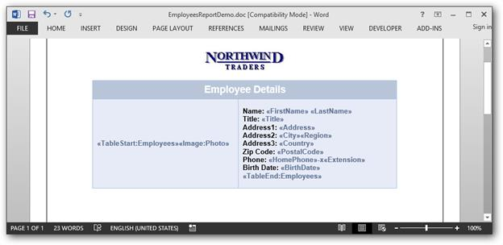
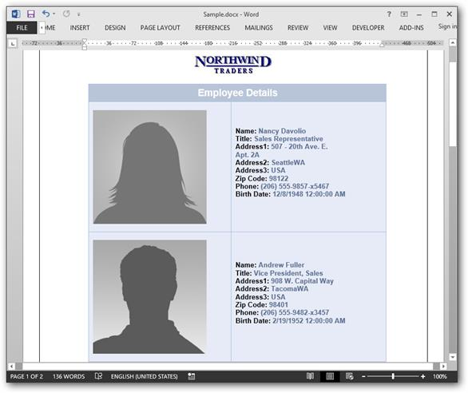
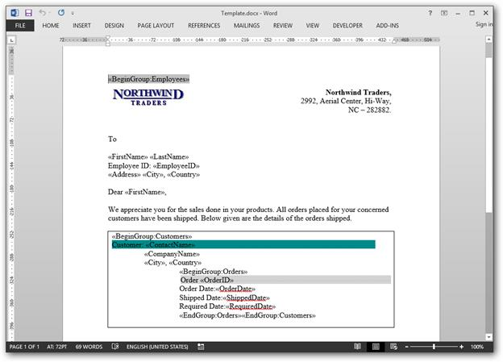

# MailMerge

Mail Merge is a process of merging data from data source to a Word template document. **WMergeField** class provides support to bind template document and data source. **WMergeField** instance is replaced with the actual data retrieved from data source for the given merge field name in a template document.

The following data sources are supported by Essential DocIO for performing mail merge.

* String Arrays
* ADO.NET objects
* Dynamic objects
* Business objects

You can create a template document with Merge fields by using the Microsoft Word. The following screenshot shows how to insert a merge filed in the Word document by using the Microsoft Word.

You need to add a prefix (“Image:”) to the merge field name for merging an image in the place of a merge field.

For example: The merge field name should be like “Image:Photo” (<<Image:MergeFieldName>>)

## Simple mail merge

The MailMerge class provides various overloads for Execute method to perform mail merge from various data sources. The Mail merge operation replaces the matching merge fields with the respective data.

The following code example shows how to create a Word template document with merge fields.


[c#]

//Creates an instance of a WordDocument 

WordDocument document = new WordDocument();

//Adds one section and one paragraph to the document

document.EnsureMinimal();

//Sets page margins to the last section of the document

document.LastSection.PageSetup.Margins.All = 72;

//Appends text to the last paragraph.

document.LastParagraph.AppendText("Emp_Id: ");

//Appends merge field to the last paragraph.

document.LastParagraph.AppendField("Emp_Id", FieldType.FieldMergeField);

document.LastParagraph.AppendText("\nName: ");

document.LastParagraph.AppendField("Name", FieldType.FieldMergeField);

document.LastParagraph.AppendText("\nPhone: ");

document.LastParagraph.AppendField("Phone", FieldType.FieldMergeField);

document.LastParagraph.AppendText("\nCity: ");

document.LastParagraph.AppendField("City", FieldType.FieldMergeField);

//Saves and closes the WordDocument instance.

document.Save("Template.docx", FormatType.Docx);

document.Close();




[VB]

'Creates an instance of a WordDocument 

Dim document As New WordDocument()

'Adds one section and one paragraph to the document

document.EnsureMinimal()

'Sets page margins to the last section of the document

document.LastSection.PageSetup.Margins.All = 72

'Appends text to the last paragraph.

document.LastParagraph.AppendText("Emp_Id: ")

'Appends merge field to the last paragraph.

document.LastParagraph.AppendField("Emp_Id", FieldType.FieldMergeField)

document.LastParagraph.AppendText(vbLf & "Name: ")

document.LastParagraph.AppendField("Name", FieldType.FieldMergeField)

document.LastParagraph.AppendText(vbLf & "Phone: ")

document.LastParagraph.AppendField("Phone", FieldType.FieldMergeField)

document.LastParagraph.AppendText(vbLf & "City: ")

document.LastParagraph.AppendField("City", FieldType.FieldMergeField)

'Saves and closes the WordDocument instance.

document.Save("Template.docx", FormatType.Docx)

document.Close()



The generated template document looks as follows.

The following code example shows how to perform a simple mail merge in the generated template document with string array as data source.


[C#]

//Opens the template document.

WordDocument document = new WordDocument("Template.docx");

string[] fieldNames = new string[] { "Emp_Id", "Name", "Phone", "City" };

string[] fieldValues = new string[] { "1001", "Peter", "+122-2222222", "London" };

//Performs the mail merge.

document.MailMerge.Execute(fieldNames, fieldValues);

//Saves and closes the WordDocument instance

document.Save("Sample.docx", FormatType.Docx);

document.Close();




[VB]

'Opens the template document.

Dim document As New WordDocument("Template.docx")

Dim fieldNames As String() = New String() {"Emp_Id", "Name", "Phone", "City"}

Dim fieldValues As String() = New String() {"1001", "Peter", "+122-2222222", "London"}

'Performs the mail merge.

document.MailMerge.Execute(fieldNames, fieldValues)

'Saves and closes the WordDocument instance

document.Save("Sample.docx", FormatType.Docx)

document.Close()



The resultant document looks as follows.

## Performing Mail merge for a group

You can perform mail merge and append multiple records from data source within a specified region to a template document. The region between start and end groups merge fields. It gets repeated for every record from the data source. The region where the mail merge operations are to be performed must be marked by two MergeFields with the following names.

* «TableStart:TableName» and «BeginGroup:GroupName» - For the entry point of the region
* «TableEnd:TableName» and «EndGroup:GroupName» - For the end point of the region

1. TableStart and TableEnd region is preferred for performing mail merge inside the table cell 
2. BeginGroup and EndGroup region is preferred for performing mail merge inside the document body contents.

For example – Consider that you have a template document as shown.

In this template, **Employees** is the group name and the same name should be used while performing mail merge through code. There are two special merge fields “TableStart:Employees” and “TableEnd:Employees”, to denote the start and end of the mail merge group. 

The MailMerge class provides various overloads for ExecuteGroup method to perform mail merge within a group from various data sources. The following code example shows how to perform mail merge in the specific region with data source retrieved from SQL connection.


[C#]

WordDocument document = new WordDocument("EmployeesTemplate.docx");

//Gets the data table. 

DataTable table = GetDataTable();

// Executes Mail Merge with groups. 

document.MailMerge.ExecuteGroup(table);

//Saves and closes the WordDocument instance

document.Save("Result.docx");

document.Close();




[VB]

Dim document As New WordDocument("EmployeesTemplate.docx")

'Gets the data table. 

Dim table As DataTable = GetDataTable()

' Executes Mail Merge with groups. 

document.MailMerge.ExecuteGroup(table)

'Saves and closes the WordDocument instance

document.Save("Result.docx")

document.Close()



The following code example provides supporting methods for the above code.


[C#]

private DataTable GetDataTable()

{

SqlCeConnection conn = new SqlCeConnection("Data Source = " + datasourceName);

conn.Open();

SqlCeDataAdapter adapter = new SqlCeDataAdapter("Select TOP(5) * from EmployeesReport", conn);

adapter.Fill(dataset);

adapter.Dispose();

conn.Close();

System.Data.DataTable table = dataset.Tables[0];

// Sets table name as Employess for template mergefield reference.

table.TableName = "Employees";

return table;

}




[VB]

Private Function GetDataTable() As DataTable

Dim conn As New SqlCeConnection ("Data Source = " + datasourceName)

conn.Open()

Dim adapter As New SqlCeDataAdapter ("Select TOP(5) * from EmployeesReport", conn)

adapter.Fill(dataset)

adapter.Dispose()

conn.Close()

Dim table As System.Data.DataTable = dataset.Tables(0)

' Sets table name as Employess for template mergefield reference.

table.TableName = "Employees"

Return table

End Function



The resultant document looks as follows.

## Performing Nested Mail merge for group

You can perform nested mail merge with relational or hierarchical data source and independent data tables in a template document.

You need to define the commands with table name and expression for linking the independent data tables during nested mail merge process. You can use the **“%****TableName****.****ColumnName****%”** expression for getting the current value of specified column in a table. 

Nested mail merge operation automatically replaces the merge field with immediate group data. You can also predefine the group data that is populated to a merge field. You need to add a corresponding group name as a prefix to the merge field name for merging a specific group data to the merge field.

For example: 

* The merge field name should be like “TableName:Id” (<<TableName:MergeFieldName>>)
* The merge field name should be like “Image:TableName:Photo” (<<Image:TableName:MergeFieldName>>)

The following code example shows how to perform a nested mail merge.


[C#]

//Opens the template document. 

WordDocument document = new WordDocument("Template.docx");

//Gets the data from the database.

OleDbConnection conn = new OleDbConnection("Provider=Microsoft.Jet.OLEDB.4.0;Data Source=" + dataBase);

conn.Open();

//Arraylist contains the list of commands.

ArrayList commands = GetCommands();

//Executes the mail merge.

document.MailMerge.ExecuteNestedGroup(conn, commands);

//Saves and closes the Word document instance

document.Save("Sample.docx", FormatType.Docx);

document.Close();




[VB]

'Opens the template document. 

Dim document As New WordDocument("Template.docx")

'Gets the data from the database.

Dim conn As New OleDbConnection("Provider=Microsoft.Jet.OLEDB.4.0;Data Source=" + dataBase)

conn.Open()

'Arraylist contains the list of commands.

Dim commands As ArrayList = GetCommands()

'Executes the mail merge.

document.MailMerge.ExecuteNestedGroup(conn, commands)

'Saves and closes the Word document instance

document.Save("Sample.docx", FormatType.Docx)

document.Close()



The following code example provides supporting methods for the above code.


[c#]

private ArrayList GetCommands()

{

//Arraylist contains the list of commands.

ArrayList commands = new ArrayList();

//DictionaryEntry contains "Source table" (key) and "Command" (value).

DictionaryEntry entry = new DictionaryEntry("Employees", "Select TOP 10 * from Employees");

commands.Add(entry);

//Retrieves the customer details.

entry = new DictionaryEntry("Customers", "SELECT DISTINCT TOP 10 * FROM  ((Orders INNER JOIN Employees ON Orders.EmployeeID = Employees.EmployeeID) INNER JOIN Customers ON Orders.CustomerID = Customers.CustomerID) WHERE Employees.EmployeeID = %Employees.EmployeeID%");

commands.Add(entry);

//Retrieves the order details.

entry = new DictionaryEntry("Orders", "SELECT DISTINCT TOP 10 * FROM Orders WHERE Orders.CustomerID = '%Customers.CustomerID%’AND Orders.EmployeeID = %Employees.EmployeeID%");

commands.Add(entry);

return commands;

}




[VB]

Private Function GetCommands() As ArrayList

'Arraylist contains the list of commands.

Dim commands As New ArrayList()

'DictionaryEntry contains "Source table" (key) and "Command" (value).

Dim entry As New DictionaryEntry("Employees", "Select TOP 10 * from Employees")

commands.Add(entry)

'Retrieves the customer details.

entry = New DictionaryEntry("Customers", "SELECT DISTINCT TOP 10 * FROM  ((Orders INNER JOIN Employees ON Orders.EmployeeID = Employees.EmployeeID) INNER JOIN Customers ON Orders.CustomerID = Customers.CustomerID) WHERE Employees.EmployeeID = %Employees.EmployeeID%")

commands.Add(entry)

'Retrieves the order details.

entry = New DictionaryEntry("Orders", "SELECT DISTINCT TOP 10 * FROM Orders WHERE Orders.CustomerID = '%Customers.CustomerID%’AND Orders.EmployeeID = %Employees.EmployeeID%")

commands.Add(entry)

Return commands

End Function



## Performing Mail merge with dynamic objects

Essential DocIO allows you to perform mail merge with the dynamic objects. The following code snippet shows how to perform the mail merge with dynamic objects ([ExpandoObject](https://msdn.microsoft.com/en-us/library/system.dynamic.expandoobject(v=vs.110).aspx# "")).


[c#]

//Opens the template document. 

WordDocument document = new WordDocument("Template.docx");

//Creates an instance of the MailMergeDataSet.

MailMergeDataSet dataSet = new MailMergeDataSet();

//Creates the mail merge data table in order to perform mail merge

MailMergeDataTable dataTable = new MailMergeDataTable("Customers", GetCustomers());

dataSet.Add(dataTable);

dataTable = new MailMergeDataTable("Orders", GetOrders());

dataSet.Add(dataTable);

List<DictionaryEntry> commands = new List<DictionaryEntry>();

// DictionaryEntry contain "Source table" (key) and "Command" (value).

DictionaryEntry entry = new DictionaryEntry("Customers", string.Empty);

commands.Add(entry);

//Retrieves the customer details

entry = new DictionaryEntry("Orders", "CustomerID = %Customer.CustomerID%");

commands.Add(entry);

//Performs the mail merge operation with the dynamic collection

document.MailMerge.ExecuteNestedGroup(dataSet, commands);

//Saves and closes the Word document instance

document.Save("Sample.docx", FormatType.Docx);

document.Close();




[VB]

'Opens the template document. 

Dim document As New WordDocument("Template.docx")

'Creates an instance of the MailMergeDataSet.

Dim dataSet As New MailMergeDataSet()

'Creates the mail merge data table in order to perform mail merge

Dim dataTable As New MailMergeDataTable("Customers", GetCustomers())

dataSet.Add(dataTable)

dataTable = New MailMergeDataTable("Orders", GetOrders())

dataSet.Add(dataTable)

Dim commands As New List(Of DictionaryEntry)()

' DictionaryEntry contain "Source table" (key) and "Command" (value).

Dim entry As New DictionaryEntry("Customers", String.Empty)

commands.Add(entry)

'Retrieves the customer details

entry = New DictionaryEntry("Orders", "CustomerID = %Customer.CustomerID%")

commands.Add(entry)

'Performs the mail merge operation with the dynamic collection

document.MailMerge.ExecuteNestedGroup(dataSet, commands)

'Saves and closes the Word document instance

document.Save("Sample.docx", FormatType.Docx)

document.Close()



The following code example provides supporting methods for the above code.


private List<ExpandoObject> GetCustomers()

{

List<ExpandoObject> customers = new List<ExpandoObject>();

customers.Add(GetDynamicCustomer(100, "Robert", "Syncfusion"));

customers.Add(GetDynamicCustomer(102, "Sunil", "Syncfusion"));

customers.Add(GetDynamicCustomer(110,"David","Syncfusion"));

return customers;

}

private List<ExpandoObject> GetOrders()

{

List<ExpandoObject> orders = new List<ExpandoObject>();

orders.Add(GetDynamicOrder(1001, "MSWord", 100));

orders.Add(GetDynamicOrder(1002, "Adopereader", 100));      

orders.Add(GetDynamicOrder(1003, "VisualStudio", 102));

return orders;

}

private dynamic GetDynamicCustomer(int customerID,string customerName, string companyName)

{

dynamic dynamicCust = new ExpandoObject();

dynamicCust.CustomerID = customerID;

dynamicCust.CustomerName = customerName;

dynamicCust.CompanyName = companyName;

return dynamicCust;

}

private dynamic GetDynamicOrder(int orderID, string orderName, int customerID)

{

dynamic dynamicOrder = new ExpandoObject();

dynamicOrder.OrderID = orderID;

dynamicOrder.OrderName = orderName;

dynamicOrder.CustomerID = customerID;

return dynamicOrder;

}




[VB]

Private Function GetCustomers() As List(Of ExpandoObject)

Dim customers As New List(Of ExpandoObject)()

customers.Add(GetDynamicCustomer(100, "Robert", "Syncfusion"))

customers.Add(GetDynamicCustomer(102, "Sunil", "Syncfusion"))

customers.Add(GetDynamicCustomer(110, "David", "Syncfusion"))

Return customers

End Function

Private Function GetOrders() As List(Of ExpandoObject)

Dim orders As New List(Of ExpandoObject)()

orders.Add(GetDynamicOrder(1001, "MSWord", 100))

orders.Add(GetDynamicOrder(1002, "Adopereader", 100))

orders.Add(GetDynamicOrder(1003, "VisualStudio", 102))

Return orders

End Function

Private Function GetDynamicCustomer(customerID As Integer, customerName As String, companyName As String) As Object

Dim dynamicCust As Object = New ExpandoObject()

dynamicCust.CustomerID = customerID

dynamicCust.CustomerName = customerName

dynamicCust.CompanyName = companyName

Return dynamicCust

End Function

Private Function GetDynamicOrder(orderID As Integer, orderName As String, customerID As Integer) As Object

Dim dynamicOrder As Object = New ExpandoObject()

dynamicOrder.OrderID = orderID

dynamicOrder.OrderName = orderName

dynamicOrder.CustomerID = customerID

Return dynamicOrder

End Function



## Performing Mail merge with business objects

You can perform mail merge with business objects in a template document. The following code snippet shows how to perform mail merge with business objects


[C#]

//Opens the template document. 

WordDocument document = new WordDocument(@"Template.docx");

//Gets the employee details as “IEnumerable” collection

List<Employee> employeeList = GetEmployees();

//Creates an instance of “MailMergeDataTable” by specifying mail merge group name and “IEnumerable” collection.

MailMergeDataTable dataTable = new MailMergeDataTable("Employees", employeeList);

//Performs Mail merge

document.MailMerge.ExecuteGroup(dataTable);

//Saves and closes the Word document instance

document.Save("Result.docx");

document.Close();




[VB]

'Opens the template document. 

Dim document As New WordDocument("Template.docx")

'Gets the employee details as “IEnumerable” collection

Dim employeeList As List(Of Employee) = GetEmployees()

'Creates an instance of “MailMergeDataTable” by specifying mail merge group name and “IEnumerable” collection.

Dim dataTable As New MailMergeDataTable("Employees", employeeList)

'Performs Mail merge

document.MailMerge.ExecuteGroup(dataTable)

'Saves and closes the Word document instance

document.Save("Result.docx")

document.Close()



The following code example provides supporting methods and class for the above code


public List<Employee> GetEmployees()

{

List<Employee> employees = new List<Employee>();

employees.Add(new Employee("Nancy", "Davolio", "Sales Representative", "505 - 20th Ave. E. Apt. 2A,", "Seattle", "WA", "USA", "Nancy.png"));

employees.Add(new Employee("Andrew", "Fuller", "Vice President, Sales", "908 W. Capital Way", "Tacoma", "WA", "USA", "Andrew.png"));

employees.Add(new Employee("Janet", "Leverling", "Sales Representative", "722 Moss Bay Blvd.", "Kirkland", "WA", "USA", "Janet.png"));

employees.Add(new Employee("Margaret", "Peacock", "Sales Representative", "4110 Old Redmond Rd.", "Redmond", "WA", "USA", "Margaret.png"));

employees.Add(new Employee("Steven", "Buchanan", "Sales Manager", "14 Garrett Hill", "London", string.Empty, "UK", "Steven.png"));

return employees;

}

public class Employee

{

public string FirstName { get; set; }

public string LastName { get; set; }

public string Address { get; set; }

public string City { get; set; }

public string Region { get; set; }

public string Country { get; set; }

public string Title { get; set; }

public Image Photo { get; set; }

public Employee(string firstName, string lastName, string title, string address, string city, string region, string country, string photoFilePath)

{

FirstName = firstName;

LastName = lastName;

Title = title;

Address = address;

City = city;

Region = region;

Country = country;

Photo = Image.FromFile(photoFilePath);

}

}




[VB]

Public Function GetEmployees() As List(Of Employee)

Dim employees As New List(Of Employee)()

employees.Add(New Employee("Nancy", "Davolio", "Sales Representative", "505 - 20th Ave. E. Apt. 2A,", "Seattle", "WA", _

"USA", "Nancy.png"))

employees.Add(New Employee("Andrew", "Fuller", "Vice President, Sales", "908 W. Capital Way", "Tacoma", "WA", _

"USA", "Andrew.png"))

employees.Add(New Employee("Janet", "Leverling", "Sales Representative", "722 Moss Bay Blvd.", "Kirkland", "WA", _

"USA", "Janet.png"))

employees.Add(New Employee("Margaret", "Peacock", "Sales Representative", "4110 Old Redmond Rd.", "Redmond", "WA", _

"USA", "Margaret.png"))

employees.Add(New Employee("Steven", "Buchanan", "Sales Manager", "14 Garrett Hill", "London", String.Empty, _

"UK", "Steven.png"))

Return employees

End Function

Public Class Employee

Public Property FirstName() As String

Get

Return m_FirstName

End Get

Set(value As String)

m_FirstName = Value

End Set

End Property

Private m_FirstName As String

Public Property LastName() As String

Get

Return m_LastName

End Get

Set(value As String)

m_LastName = Value

End Set

End Property

Private m_LastName As String

Public Property Address() As String

Get

Return m_Address

End Get

Set(value As String)

m_Address = Value

End Set

End Property

Private m_Address As String

Public Property City() As String

Get

Return m_City

End Get

Set(value As String)

m_City = Value

End Set

End Property

Private m_City As String

Public Property Region() As String

Get

Return m_Region

End Get

Set(value As String)

m_Region = Value

End Set

End Property

Private m_Region As String

Public Property Country() As String

Get

Return m_Country

End Get

Set(value As String)

m_Country = Value

End Set

End Property

Private m_Country As String

Public Property Title() As String

Get

Return m_Title

End Get

Set(value As String)

m_Title = Value

End Set

End Property

Private m_Title As String

Public Property Photo() As Image

Get

Return m_Photo

End Get

Set(value As Image)

m_Photo = Value

End Set

End Property

Private m_Photo As Image

Public Sub New(firstName__1 As String, lastName__2 As String, title__3 As String, address__4 As String, city__5 As String, region__6 As String, _

country__7 As String, photoFilePath As String)

FirstName = firstName__1

LastName = lastName__2

Title = title__3

Address = address__4

City = city__5

Region = region__6

Country = country__7

Photo = Image.FromFile(photoFilePath)

End Sub

End Class



## Performing Nested Mail merge with relational data objects

You can perform nested mail merge with implicit relational data objects without any explicit relational commands by using the ExecuteNestedGroup overload method. 

For example – Consider that you have a template document as follows.

In this template, **Employees** is the owner group and it has two child groups **Customers** and **Orders****.** 

The following code exaample shows how to perform nested mail merge with the relational business objects.


[C#]

//Opens the template document. 

WordDocument document = new WordDocument(@"Template.docx");

//Gets the employee details as “IEnumerable” collection

List<Employees> employeeList = GetEmployees();

//Creates an instance of “MailMergeDataTable” by specifying mail merge group name and “IEnumerable” collection.

MailMergeDataTable dataTable = new MailMergeDataTable("Employees", employeeList);

//Performs Mail merge

document.MailMerge.ExecuteNestedGroup(dataTable);

//Saves and closes the WordDocument instance

document.Save("Result.docx");

document.Close();




[VB]

'Opens the template document. 

Dim document As New WordDocument("Template.docx")

'Gets the employee details as “IEnumerable” collection

Dim employeeList As List(Of Employees) = GetEmployees()

'Creates an instance of “MailMergeDataTable” by specifying mail merge group name and “IEnumerable” collection.

Dim dataTable As New MailMergeDataTable("Employees", employeeList)

'Performs Mail merge

document.MailMerge.ExecuteNestedGroup(dataTable)

'Saves and closes the WordDocument instance

document.Save("Result.docx")

document.Close()



The following code example provides supporting methods for the above code.


[C#]

public static List<Employees> GetEmployees()

{

List<OrderDetails> orders = new List<OrderDetails>();

orders.Add(new OrderDetails("10835", new DateTime(2015, 1, 5), new DateTime(2015, 1, 12), new DateTime(2015, 1, 21)));

orders.Add(new OrderDetails("10952", new DateTime(2015, 2, 5), new DateTime(2015, 2, 12), new DateTime(2015, 2, 21)));

CustomerDetails customers = new CustomerDetails("Maria Anders", "Maria Anders", "Berlin", "Germany", orders);

List<Employees> employees = new List<Employees>();

employees.Add(new Employees("Nancy", "Davolio", "1", "505 - 20th Ave. E. Apt. 2A,", "Seattle", "USA", customers));

return employees;

}

public class Employees

{

public string FirstName { get; set; }

public string LastName { get; set; }

public string EmployeeID { get; set; }

public string Address { get; set; }

public string City { get; set; }

public string Country { get; set; }

public CustomerDetails Customers { get; set; }

public Employees(string firstName, string lastName, string employeeId, string address, string city, string country, CustomerDetails customers)

{

FirstName = firstName;

LastName = lastName;

Address = address;

EmployeeID = employeeId;

City = city;

Country = country;

Customers = customers;

}

}

public class CustomerDetails

{

public string ContactName { get; set; }

public string CompanyName { get; set; }

public string City { get; set; }

public string Country { get; set; }

public List<OrderDetails> Orders { get; set; }

public CustomerDetails(string contactName, string companyName, string city, string country, List<OrderDetails> orders)

{

ContactName = contactName;

CompanyName = companyName;

City = city;

Country = country;

Orders = orders;

}

}

public class OrderDetails

{

public string OrderID { get; set; }

public DateTime OrderDate { get; set; }

public DateTime ShippedDate { get; set; }

public DateTime RequiredDate { get; set; }

public OrderDetails(string orderId, DateTime orderDate, DateTime shippedDate, DateTime requiredDate)

{

OrderID = orderId;

OrderDate = orderDate;

ShippedDate = shippedDate;

RequiredDate = requiredDate;

}

}




[VB]

Public Function GetEmployees() As List(Of Employees)

Dim orders As New List(Of OrderDetails)()

orders.Add(New OrderDetails("10835", New DateTime(2015, 1, 5), New DateTime(2015, 1, 12), New DateTime(2015, 1, 21)))

orders.Add(New OrderDetails("10952", New DateTime(2015, 2, 5), New DateTime(2015, 2, 12), New DateTime(2015, 2, 21)))

Dim customers As New CustomerDetails("Maria Anders", "Maria Anders", "Berlin", "Germany", orders)

Dim employees As New List(Of Employees)()

employees.Add(New Employees("Nancy", "Davolio", "1", "505 - 20th Ave. E. Apt. 2A,", "Seattle", "USA", _

customers))

Return employees

End Function

Public Class Employees

Public Property FirstName() As String

Get

Return m_FirstName

End Get

Set(value As String)

m_FirstName = value

End Set

End Property

Private m_FirstName As String

Public Property LastName() As String

Get

Return m_LastName

End Get

Set(value As String)

m_LastName = value

End Set

End Property

Private m_LastName As String

Public Property EmployeeID() As String

Get

Return m_EmployeeID

End Get

Set(value As String)

m_EmployeeID = value

End Set

End Property

Private m_EmployeeID As String

Public Property Address() As String

Get

Return m_Address

End Get

Set(value As String)

m_Address = value

End Set

End Property

Private m_Address As String

Public Property City() As String

Get

Return m_City

End Get

Set(value As String)

m_City = value

End Set

End Property

Private m_City As String

Public Property Country() As String

Get

Return m_Country

End Get

Set(value As String)

m_Country = value

End Set

End Property

Private m_Country As String

Public Property Customers() As CustomerDetails

Get

Return m_Customers

End Get

Set(value As CustomerDetails)

m_Customers = value

End Set

End Property

Private m_Customers As CustomerDetails

Public Sub New(firstName__1 As String, lastName__2 As String, employeeId__3 As String, address__4 As String, city__5 As String, country__6 As String, _

customers__7 As CustomerDetails)

FirstName = firstName__1

LastName = lastName__2

Address = address__4

EmployeeID = employeeId__3

City = city__5

Country = country__6

Customers = customers__7

End Sub

End Class

Public Class CustomerDetails

Public Property ContactName() As String

Get

Return m_ContactName

End Get

Set(value As String)

m_ContactName = value

End Set

End Property

Private m_ContactName As String

Public Property CompanyName() As String

Get

Return m_CompanyName

End Get

Set(value As String)

m_CompanyName = value

End Set

End Property

Private m_CompanyName As String

Public Property City() As String

Get

Return m_City

End Get

Set(value As String)

m_City = value

End Set

End Property

Private m_City As String

Public Property Country() As String

Get

Return m_Country

End Get

Set(value As String)

m_Country = value

End Set

End Property

Private m_Country As String

Public Property Orders() As List(Of OrderDetails)

Get

Return m_Orders

End Get

Set(value As List(Of OrderDetails))

m_Orders = value

End Set

End Property

Private m_Orders As List(Of OrderDetails)

Public Sub New(contactName__1 As String, companyName__2 As String, city__3 As String, country__4 As String, orders__5 As List(Of OrderDetails))

ContactName = contactName__1

CompanyName = companyName__2

City = city__3

Country = country__4

Orders = orders__5

End Sub

End Class

Public Class OrderDetails

Public Property OrderID() As String

Get

Return m_OrderID

End Get

Set(value As String)

m_OrderID = value

End Set

End Property

Private m_OrderID As String

Public Property OrderDate() As DateTime

Get

Return m_OrderDate

End Get

Set(value As DateTime)

m_OrderDate = value

End Set

End Property

Private m_OrderDate As DateTime

Public Property ShippedDate() As DateTime

Get

Return m_ShippedDate

End Get

Set(value As DateTime)

m_ShippedDate = value

End Set

End Property

Private m_ShippedDate As DateTime

Public Property RequiredDate() As DateTime

Get

Return m_RequiredDate

End Get

Set(value As DateTime)

m_RequiredDate = value

End Set

End Property

Private m_RequiredDate As DateTime

Public Sub New(orderId__1 As String, orderDate__2 As DateTime, shippedDate__3 As DateTime, requiredDate__4 As DateTime)

OrderID = orderId__1

OrderDate = orderDate__2

ShippedDate = shippedDate__3

RequiredDate = requiredDate__4

End Sub

End Class



The resultant document looks as follows.

## Event support for Mail merge

The **MailMerge** class provides event support to customize the document contents and merging image data during the mail merge process. The following events are supported by Essential DocIO in mail merge process.

* **MergeField** - occurs during mail merge when a mail merge field except image mail merge field is encountered in the document
* **MergeImageField** - occurs during mail merge when a image mail merge field is encountered in the document

**MergeField** **Event**

The following code example shows how to use MergeField event during mail merge process.


[C#] 

//Opens the template document. 

WordDocument document = new WordDocument("Template.docx");    

//Uses the mail merge events to perform the conditional formatting during runtime.

document.MailMerge.MergeField += new MergeFieldEventHandler(ApplyAlternateRecordsTextColor);

//Executes Mail Merge with groups.

document.MailMerge.Execute(GetDataTable());

//Saves and closes the Word document instance

document.Save("Sample.docx", FormatType.Docx);

document.Close();




[VB]

'Opens the template document. 

Dim document As New WordDocument("Template.docx")

AddHandler document.MailMerge.MergeField, AddressOf ApplyAlternateRecordsTextColor

'Uses the mail merge events to perform the conditional formatting during runtime.

'Executes Mail Merge with groups.

document.MailMerge.Execute(GetDataTable())

'Saves and closes the Word document instance

document.Save("Sample.docx", FormatType.Docx)

document.Close()



The following code example shows how to set text color to the alternate mail merge record by using MergeFieldEventHandler.


[C#]

private void ApplyAlternateRecordsTextColor (object sender, MergeFieldEventArgs args)

{

//Sets text color to the alternate mail merge record

if (args.RowIndex % 2 == 0)

{

args.CharacterFormat.TextColor = Color.FromArgb(255, 102, 0);

}

}




[VB]

Private Function GetDataTable() As DataTable

Dim dataTable As New DataTable("Employee")

dataTable.Columns.Add("EmpName")

dataTable.Columns.Add("EmpNumber")

For i As Integer = 0 To 19

Dim datarow As DataRow = dataTable.NewRow()

dataTable.Rows.Add(datarow)

datarow(0) = "Emp" + i.ToString()

datarow(1) = "Emp" + i.ToString()

Next

Return dataTable

End Function



The following code example provides supporting methods


[C#]

private static DataTable GetDataTable()

{

DataTable dataTable = new DataTable("Employee");

dataTable.Columns.Add("EmpName");

dataTable.Columns.Add("EmpNumber");

for (int i = 0; i < 20; i++)

{

DataRow datarow = dataTable.NewRow();

dataTable.Rows.Add(datarow);

datarow[0] = "Emp" + i.ToString();

datarow[1] = "Emp" + i.ToString();

}

return dataTable;

}




[VB]

Private Function GetDataTable() As DataTable

Dim dataTable As New DataTable("Employee")

dataTable.Columns.Add("EmpName")

dataTable.Columns.Add("EmpNumber")

For i As Integer = 0 To 19

Dim datarow As DataRow = dataTable.NewRow()

dataTable.Rows.Add(datarow)

datarow(0) = "Emp" + i.ToString()

datarow(1) = "Emp" + i.ToString()

Next

Return dataTable

End Function



**MergeImageField** **event**

The following code example shows how to use MergeImageField event during mail merge process.


[C#]

//Opens the template document

WordDocument document = new WordDocument("Template.docx");

//Uses the mail merge events handler for image fields

document.MailMerge.MergeImageField += new MergeImageFieldEventHandler(MergeField_ProductImage);

//Specifies the field names and field values

string[] fieldNames = new string[] { "EmployeeImage"};

string[] fieldValues = new string[] { "Steven.png"};

//Executes the mail merge with groups

document.MailMerge.Execute(fieldNames, fieldValues);

//Saves and closes WordDocument instance

document.Save("Sample.docx", FormatType.Docx);

document.Close();




[VB]

'Opens the template document

Dim document As New WordDocument("Template.docx")

'Uses the mail merge events handler for image fields

AddHandler document.MailMerge.MergeImageField, AddressOf MergeField_ProductImage

'Specifies the field names and field values

Dim fieldNames As String() = New String() {"EmployeeImage"}

Dim fieldValues As String() = New String() {"Steven.png"}

'Executes the mail merge with groups

document.MailMerge.Execute(fieldNames, fieldValues)

'Saves and closes WordDocument instance

document.Save("Sample.docx", FormatType.Docx)

document.Close()



The following code example shows how to bind the image from file system during mail merge process by using MergeImageFieldEventHandler.


[C#]

private void MergeField_ProductImage(object sender, MergeImageFieldEventArgs args)

{ 

//Binds image from file system during mail merge

if (args.FieldName == "EmployeeImage")

{

string ProductFileName = args.FieldValue.ToString();

args.Image = Image.FromFile(ProductFileName);

}

}




[VB]

Private Sub MergeField_ProductImage(ByVal sender As Object, ByVal args As MergeImageFieldEventArgs)

'Binds image from file system during mail merge

If args.FieldName = "EmployeeImage" Then

Dim ProductFileName As String = args.FieldValue.ToString()

args.Image = Image.FromFile(ProductFileName)

End If

End Sub



## Mail merge options

The MailMerge class allows you to customize the mail merge process with the following options.

### Field Mapping

The MailMerge class can automatically maps the merge field names with data source column names during mail merge process. You can also customize the field mapping when the merge field names in the template document varies with the column names in the data source by using MappedFields collection.

The following code example shows how to add mapping when a merge field name in a document and column name in a data source have different names.


[C#]

//Opens the template document. 

WordDocument document = new WordDocument("Template.docx");

//Creates data source

string[] fieldNames = new string[] { "Emp_Id_InDataSource", "Name_InDataSource", "Phone_InDataSource", "City_InDataSource" };

string[] fieldValues = new string[] { "101", "Alkin", "+122-2000466", "Houston" };

//Mapping the required merge field names with data source column names

document.MailMerge.MappedFields.Add("Emp_Id_InDocument", "Emp_Id_InDataSource");

document.MailMerge.MappedFields.Add("Name_InDocument", "Name_InDataSource");

document.MailMerge.MappedFields.Add("Phone_InDocument", "Phone_InDataSource");

document.MailMerge.MappedFields.Add("City_InDocument", "City_InDataSource");

//Performs the mail merge

document.MailMerge.Execute(fieldNames, fieldValues);

//Saves and closes the Word document instance

document.Save("Sample.docx", FormatType.Docx);

document.Close();




[VB]

'Opens the template document. 

Dim document As New WordDocument("Template.docx")

'Creates data source

Dim fieldNames As String() = New String() {"Emp_Id_InDataSource", "Name_InDataSource", "Phone_InDataSource", "City_InDataSource"}

Dim fieldValues As String() = New String() {"101", "Alkin", "+122-2000466", "Houston"}

'Mapping the required merge field names with data source column names

document.MailMerge.MappedFields.Add("Emp_Id_InDocument", "Emp_Id_InDataSource")

document.MailMerge.MappedFields.Add("Name_InDocument", "Name_InDataSource")

document.MailMerge.MappedFields.Add("Phone_InDocument", "Phone_InDataSource")

document.MailMerge.MappedFields.Add("City_InDocument", "City_InDataSource")

'Performs the mail merge

document.MailMerge.Execute(fieldNames, fieldValues)

'Saves and closes the Word document instance

document.Save("Sample.docx", FormatType.Docx)

document.Close()



### Retrieving the merge field names

The following code example shows how to retrieve the merge field names in the Word document


[C#]

//Gets the merge field names from the document.

string[] filednames = document.MailMerge.GetMergeFieldNames()




[VB]

'Gets the merge field names from the document.

Dim filednames As String() = document.MailMerge.GetMergeFieldNames()



The following code example shows how to retrieve the merge field group names in the Word document


[C#]

//Gets the merge field group names from the document.

string[] groupNames = document.MailMerge.GetMergeGroupNames();




[VB]

'Gets the merge field group names from the document.

Dim groupNames As String() = document.MailMerge.GetMergeGroupNames()



The following code example shows how to retrieve the merge field names for a specific group in the Word document


[C#]

//Gets the fields from the specified groups. 

string[] filednames = document.MailMerge.GetMergeFieldNames(groupName);




[VB]

'Gets the fields from the specified groups. 

Dim filednames As String() = document.MailMerge.GetMergeFieldNames(groupName)



### Removing empty merge fields

The following code example shows how to remove the empty paragraphs when the paragraph has a merge field item without any data during mail merge process.


[C#]

//Opens the template document. 

WordDocument document = new WordDocument("Template.docx");

//Removes paragraph that contains only empty fields. 

document.MailMerge.RemoveEmptyParagraphs = true;

string[] fieldNames = new string[] { "Emp_Id", "Phone", "City" };

string[] fieldValues = new string[] { "1001", "+91-9999999999", "London" };

//Performs the mail merge.

document.MailMerge.Execute(fieldNames, fieldValues);

//Saves and closes the Word document instance

document.Save("Sample.docx", FormatType.Docx);

document.Close();




[VB]

'Opens the template document. 

Dim document As New WordDocument("Template.docx")

'Removes paragraph that contains only empty fields. 

document.MailMerge.RemoveEmptyParagraphs = True

Dim fieldNames As String() = New String() {"Emp_Id", "Phone", "City"}

Dim fieldValues As String() = New String() {"1001", "+91-9999999999", "London"}

'Performs the mail merge.

document.MailMerge.Execute(fieldNames, fieldValues)

'Saves and closes the Word document instance

document.Save("Sample.docx", FormatType.Docx)

document.Close()



Mail merge operation automatically removes the merge fields that do not have data in data source during mail merge process. The following code example shows how to keep the merge fields in the generated Word document when the merge field name is mapped with data source during mail merge process.


[C#]

//Opens the template document. 

WordDocument document = new WordDocument("Template.docx");

//Sets “ClearFields” to true to remove empty mail merge fields from document. 

document.MailMerge.ClearFields = false;

string[] fieldNames = new string[] { "Emp_Id", "Phone", "City" };

string[] fieldValues = new string[] { "1001", "+91-9999999999", "London" };

//Performs the mail merge.

document.MailMerge.Execute(fieldNames, fieldValues);

//Saves and closes the Word document instance

document.Save("Sample.docx", FormatType.Docx);

document.Close();




[VB]

'Opens the template document. 

Dim document As New WordDocument("Template.docx")

'Sets “ClearFields” to true to remove empty mail merge fields from document. 

document.MailMerge.ClearFields = False

Dim fieldNames As String() = New String() {"Emp_Id", "Phone", "City"}

Dim fieldValues As String() = New String() {"1001", "+91-9999999999", "London"}

'Performs the mail merge.

document.MailMerge.Execute(fieldNames, fieldValues)

'Saves and closes the Word document instance

document.Save("Sample.docx", FormatType.Docx)

document.Close()



